Introduce
==========
이번 위키에서는 Buffer Manager의 구현에 대하여 설명하겠습니다.        
   
이에 앞서, 각각의 파일들이 어떠한 역할을 하는 지에 대해 설명하겠습니다.  
   
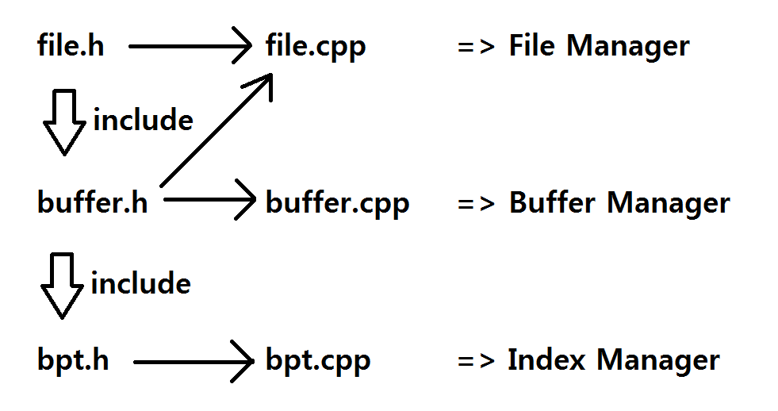
    
Buffer Manager는 File Manager의 API를 사용하고, Index Manager는 Buffer Manager의 API를 사용하기 때문에
file.h => buffer.h => bpt.h 와 같은 순서로 include를 진행하였습니다.   
   
file.cpp는 File Manager의 역할을 구현하는 부분으로써 file.h를 include하였습니다.    
또한 내부적으로 Buffer Manager의 API(buffer read/write)도 사용하기 때문에 바로 위의 계층인 buffer.h 또한 include하였습니다.
    
buffer.cpp는 Buffer Manager의 역할을 구현하는 부분입니다. buffer.h를 include하였습니다.   
   
bpt.cpp는 Index Manager의 역할을 구현하는 부분입니다. bpt.h를 include하였습니다.   
   
   
또한 이제부터는 하나의 파일이 아니라 여러 파일을 대상으로 하기 때문에 그에 따르는 변경사항도 설명하겠습니다.      
이제부터는 여러 파일들을 대상으로 작동해야하기 때문에 이들을 관리하는 추가적인 객체들을 정의하였습니다.   
   
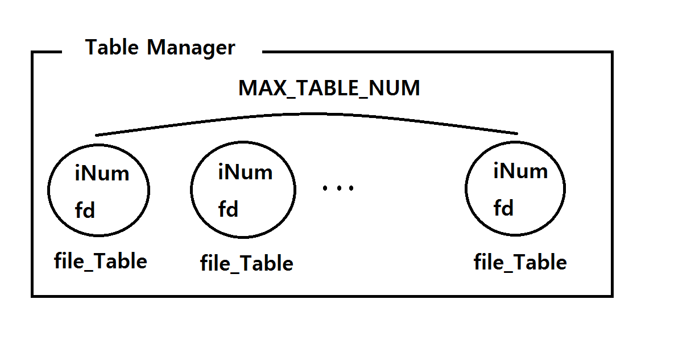
   
file_Table객체는 File Manager부분에 정의되어있으며 특정 파일의 i노드 번호와 fd에 대한 정보를 가지고 있습니다.   
i노드 번호는 기본적으로 0으로 초기화되어있고, fd는 -2로 초기화되어있습니다.   
fd를 -2로 초기화한 이유는 해당 파일이 open되었다가 close되었다면 -1로 설정하고, 아예 열린적이 없다면 -2로 유지하기 위함입니다.   
   
TableManager객체는 Index Manager부분에 정의되어있으며 최대 MAX_TABLE_NUM개의 file_Table객체들을 table_id개념으로 관리합니다.   
   
구현에 대한 보다 자세한 설명은 [File Manager API modification](#file-manager-api-modification)과 [Index Manager Command modification](#index-manager-command-modification)에서 설명하겠습니다.   

Features
========
[1. Buffer Manager API](#buffer-manager-api)
   
[2. File Manager API modification](#file-manager-api-modification)
   
[3. Index Manager Command modification](#index-manager-command-modification)
   
Buffer Manager   
==============
디스크 I/O를 최소화 하기위해 Index 계층과 Disk 계층 사이에 위치하게 되는 계층입니다.   
     
해당 계층의 역할은 다음과 같습니다.   
1. 메모리 상에 페이지를 저장하여 해당 페이지에 대한 read가 생길 시 디스크가 아니라 메모리에서 불러오는 역할을 해주는 caching   
2. 페이지에 대한 수정을 할 때 디스크를 바로 수정하지 않고 버퍼를 수정함으로써 Index 계층이 디스크 입력을 기다리지 않고 다음 행동 수행 가능
   
본 프로젝트에서는 c++언어를 사용하여 구현하였고 리눅스 환경에서 g++ 7.5.0로 컴파일되었습니다.
   
## Buffer Manager API
+ [Introduce](#introduce)
+ [Header File](#header-file)
+ [버퍼 제어를 위한 객체들의 멤버 함수](#버퍼-제어를-위한-객체들의-멤버-함수)
+ [API](#api)

> ### Introduce
Buffer Manager는 API의 작동을 위해 크게 4가지의 객체를 이용하게 됩니다.     
    
+ #### Buffer 배열   
페이지들을 메모리 상에 저장할 Buffer Structure들의 배열입니다.   
유저가 Buffer Manager의 API 중 하나인 init_db함수를 통해 동적할당하여 생성하게 됩니다.   
   
+ #### LRU_HEAD, LRU_TAIL (LRU LIST)   
이번 디자인에서는 페이지 eviction을 위해 LRU policy를 사용합니다.      
이를 위해 Buffer 배열의 논리적인 구조를 Double Linked List 형태로 생각할 것이고 이를 제어하기 위해 사용되는 객체들입니다.   
   
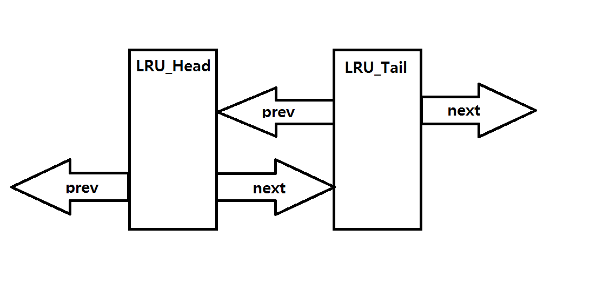
   
버퍼에 새로운 페이지가 들어오게 된다면 LRU_HEAD의 next가 해당 페이지를 가리키게 됩니다.   
   
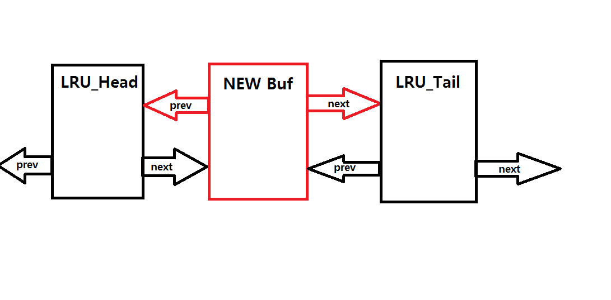
   
이미 버퍼에 존재하던 페이지에 재접근 시에는 해당 페이지를 LRU LIST에서 뽑아낸 뒤 LRU_HEAD의 next로 보냅니다.   
이 때, 해당 버퍼가 Tail의 prev일 필요는 없습니다.   
   
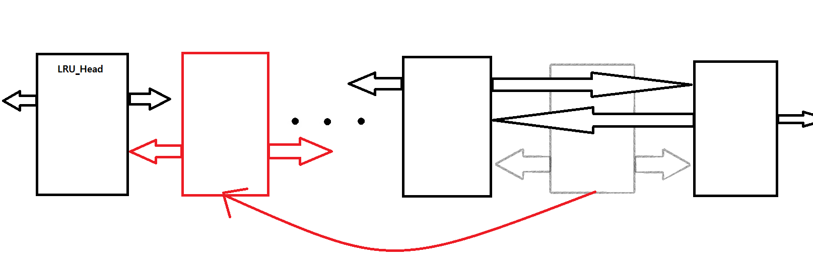
   
버퍼에 존재하지 않는 페이지를 읽어야 하는데 버퍼에 자리가 없다면 LRU policy에 따라서 LRU_TAIL의 prev를 eviction하게 됩니다.   
   
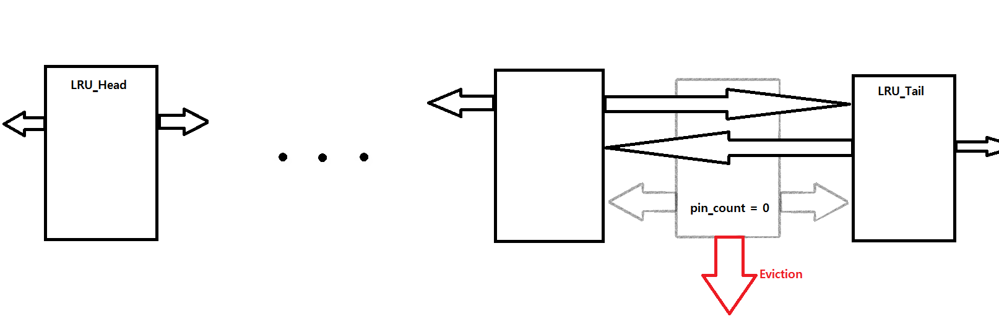
   
만약 해당 prev의 pin_count가 0이 아니라면 LRU LIST를 순회하면서 eviction할 버퍼의 위치를 찾습니다.   
LRU_Head의 next까지 도착했음에도 eviction할 버퍼를 찾지 못했다면 LRU_Tail의 prev부터 다시 시작합니다.
   
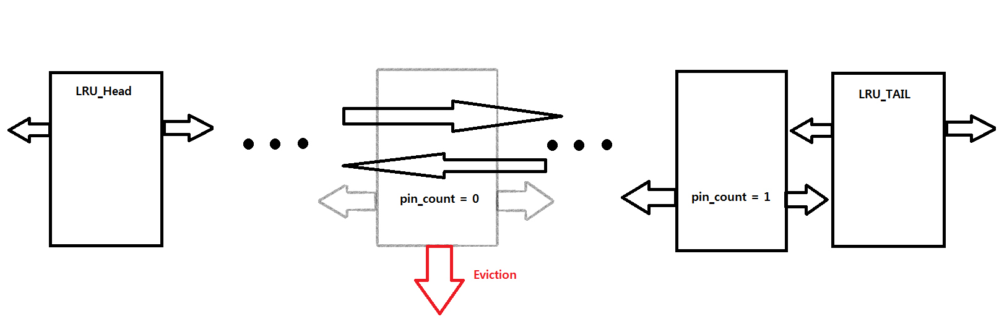
   
그리고 이러한 LRU LIST의 제어들에는 insert_into_LRUList, remove_from_LRUList, get_from_LRUList 이라는 함수들이 사용됩니다.   

+ #### 해쉬 객체   
해쉬 객체는 버퍼 내에서 특정 페이지가 어느 위치에 있는 지 파악하기 위해 쓰이는 객체입니다.    
     
init_db를 호출하면 테이블 id마다 해쉬 객체가 할당됩니다.    
내부에는 해쉬 테이블과 이 테이블 안에 어떤 페이지들이 있는 지 알 수 있는 리스트가 존재합니다.   
    
해쉬 테이블은 버퍼의 개수만큼 칸을 가지고 chaining hash 디자인을 사용합니다. 또한 해쉬 함수로 나머지를 이용합니다.   
예를 들어 버퍼의 개수가 100개라는 가정하에, 1058이라는 페이지 번호는 해쉬테이블에서 58번 자리에 위치하게 됩니다.   
   
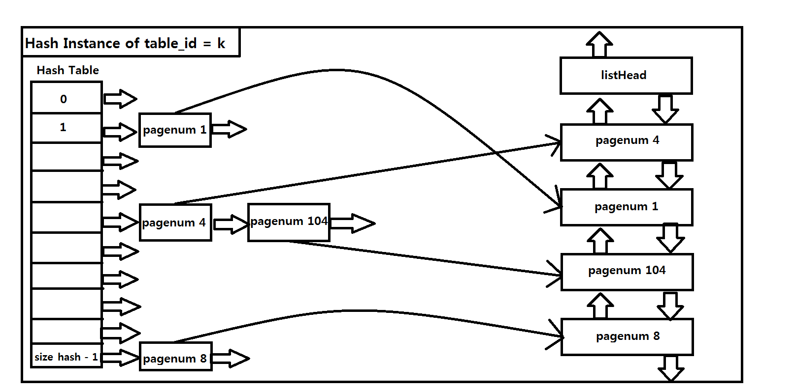
   
해쉬 테이블에 대해서 해당 객체는 find_Hash, insert_Hash, delete_Hash 함수를 사용하게 됩니다.   
   
find_Hash를 통해 해당 테이블에 대해서 유저가 원하는 페이지를 담은 버퍼의 위치를 파악합니다.   
   
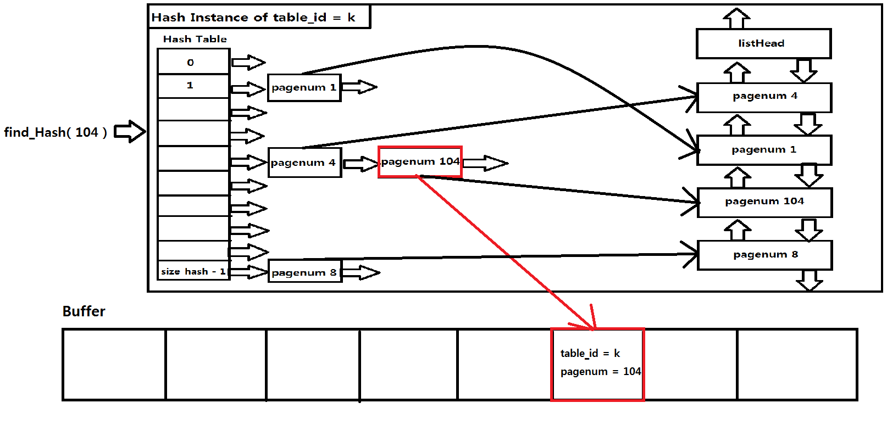
   
insert_Hash를 통해 해쉬 객체에 새로운 페이지를 추가하게 됩니다. 
   
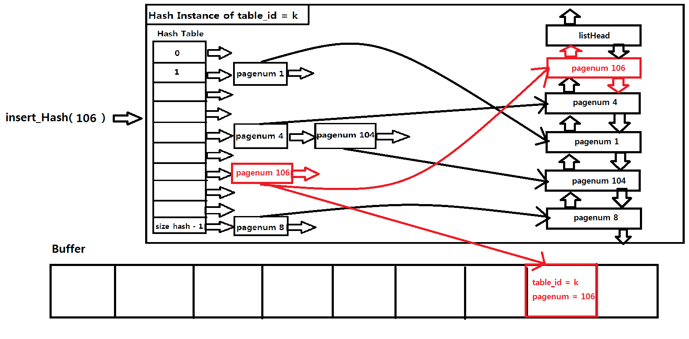
   
delete_Hash를 통해 해쉬 객체에 존재하는 페이지를 해쉬 테이블에서 제외시킵니다.   
   
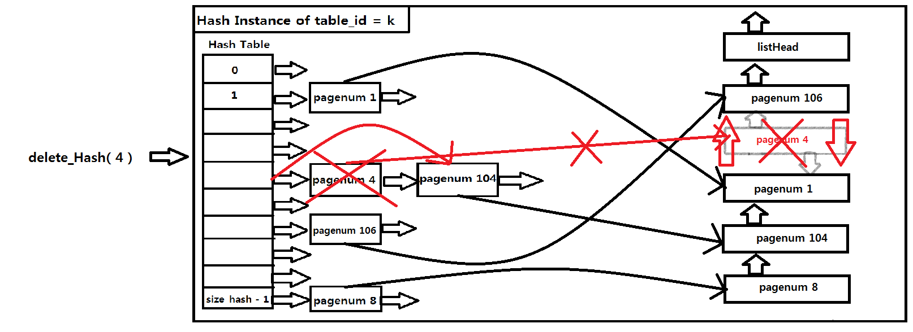

> 해쉬 테이블 속에 존재하는 링크드 리스트의 첫 번째 노드는 더미노드의 역할을 하게 됩니다.
   
객체 내부에는 해쉬 테이블뿐만 아니라 테이블 안에 무슨 페이지들이 들어있는 지를 알 수 있도록 리스트가 존재합니다.   
이러한 리스트를 유지하는 이유는 특정 테이블 id만 flush시키는 것을 효율적으로 진행하기 위함입니다.   
   
만약 이러한 리스트가 없다면   
   
1. 버퍼 전체를 순회하며 해당 테이블 id인지 확인하며 flush시키는 것   
2. 해당 테이블 id를 담당하는 해쉬테이블 전체를 순회하며 버퍼를 flush시키는 것   
      
이러한 상황을 생각할 수 있습니다. 그러나 만약 사용자가 여럿이고 pin이 0이 아닌 버퍼들이 존재한다면   
한번의 순회 후에 어떤 페이지가 버퍼안에 추가로 생겼을 지 모르기 때문에 처음부터 다시 순회를 시작해야하고 이는 시간적인 비용이 커집니다.   
   
**그러나 만약 특정 테이블 id가 현재 버퍼에서 어떤 페이지들을 사용하고 있는 지를 알고 있다면   
해당 페이지 번호들에 대해서만 find_Hash로 버퍼의 위치를 알아내어 선택적으로 버퍼에 접근할 수 있습니다.**   
   
하지만 특정 테이블 id만 flush를 시키는 것이 흔히 발생하는 동작이 아니라서 리스트를 유지하는 비용이 더 커질 수 있다는 점을 고려해야합니다.    
그렇기에 리스트를 유지하는데 드는 시간적, 공간적 비용을 최소화하기 위해서 Double Linked List를 활용하였습니다.   
   
+ 시간적 비용   
insert 시에는 헤더의 next에 추가해주기만 하면 되기에 O(1)   
delete 시에는 해쉬 테이블 상의 노드로부터 주소값을 얻어 바로 해당 위치를 찾기 때문에 O(1)       
   
+ 공간적 비용    
노드 하나당 next포인터(4바이트) + prev포인터(4바이트) + 페이지 번호(8바이트) = 16바이트   
모든 테이블 id의 해쉬 객체 속 Double Linked List 노드의 개수를 다 합쳐도 최대 버퍼의 개수가 되기 떄문에(해당 노드가 나타내는 것은 버퍼에 들어있는 페이지넘버)   
하나의 버퍼당 최대 16바이트를 추가 할당한 것으로 생각할 수 있고 flush에 걸리는 시간을 줄이는 것에 비해 크지 않은 비용이라고 판단했습니다.   
    
이러한 이유 때문에 해쉬 객체는 해당 디자인을 선택하여 해쉬 테이블에 존재하는 페이지번호를 관리하겠습니다.
   
+ #### 스택 객체
현재 어떠한 페이지도 올라오지 않은 버퍼의 주소값을 스택을 사용하여 가지고 있는 객체입니다.   
버퍼에 존재하지 않는 새로운 페이지를 버퍼에 올릴 때 스택을 활용하여 비어있는 버퍼를 찾습니다.   

> ### Header File
Buffer Manageer가 사용하는 구조체 및 클래스, 함수들을 선언하는 부분입니다.   
buffer.h로 작성되었습니다.   
   
<pre>
<code>
struct Buffer{
    FreePage frame;
    int table_id = -1;
    pagenum_t pagenum = 0;
    bool is_dirty = false;
    int pin_count = 0;
    Buffer* next = NULL;
    Buffer* prev = NULL;
};
</code>
</pre>
버퍼를 나타내는 구조체입니다.   
   
FreePage 구조체를 사용하여 버퍼에 페이지를 저장하기 위한 frame,       
버퍼가 어떤 테이블 id의 페이지를 담았는지를 나타내기 위한 table_id,      
버퍼가 담고 있는 페이지의 번호를 나타내기 위한 pagenum,    
버퍼와 디스크가 차이가 생겼는지를 나타내는 is_dirty,   
해당 버퍼를 얼마나 많은 사용자가 읽고 있는 지 나타내는 pin_count,   
LRU LIST 구조를 나타내기 위하여 next, prev 변수를 사용하였습니다.  
>바이트단위로 버퍼에서 인덱스로, 디스크에서 버퍼로 페이지를 복사할 것이기 때문에 어떠한 페이지 구조체를 사용해도 상관없습니다.     
   
<pre>
<code>
struct DoubleListNode{
	DoubleListNode* prev = NULL;
	DoubleListNode* next = NULL;
	pagenum_t pagenum = 0;
};
</code>
</pre>
해쉬 테이블에 담겨있는 리스트에 쓰이는 구조체입니다.   
리스트 내에서 서로를 연결하기 위해 prev, next라는 포인터,   
페이지번호에 대한 정보를 담기 위한 pagenum을 가지고 있습니다.   
   
<pre>
<code>
struct ListNode {
	pagenum_t pagenum = 0;
	Buffer* bufptr = NULL;
	ListNode* next = NULL;
	DoubleListNode* pagelistptr = NULL;
};
</code>
</pre>
해쉬 테이블에 사용되는 구조체입니다.   
페이지 번호를 나타내는 pagenum변수,    
만약 같은 해쉬값을 가졌다면 Linked list형태로 연결해야 하기 때문에 next변수,      
해당하는 페이지가 해시테이블 내에 존재함을 기억하기 위해서 사용되는 리스트의 노드를 가리키는 pagelistptr변수,   
해당 페이지를 담고 있는 버퍼를 가리키는 bufptr변수를 가졌습니다.   
   
<pre>
<code>
class BufferHash {
private:
	ListNode* hash;
	int size_hash;
	DoubleListNode* listHead;
public:
	int find_pos(pagenum_t pagenum);
	Buffer* find_Hash(pagenum_t pagenum);
	void insert_Hash(pagenum_t pagenum, Buffer* bufptr);
	void delete_Hash(pagenum_t);
	void setHash(int size_hash);
	void insert_doublelist(DoubleListNode* nodeptr);
	void delete_doublelist(DoubleListNode* nodeptr);
	DoubleListNode* get_listHead();
	~BufferHash();
};
</code>
</pre>
테이블 id마다 가지게 될 해쉬 객체에 대한 클래스입니다.   
해쉬 테이블의 맨 앞 주소를 hash변수를 통해 관리합니다.   
listHead는 테이블에 존재하는 페이지 번호들을 관리할 리스트의 헤더입니다.
size_hash는 해쉬 테이블이 몇칸을 가질지에 대한 변수입니다.   
   
<pre>
<code>
class BufferStack {
private:
	int num_stack;
	int max_num;
	Buffer** stack;
public:
	BufferStack(int max_num);
	void push(Buffer* bufptr);
	Buffer* pop();
	bool is_full();
	~BufferStack();
};
</code>
</pre>
빈 버퍼를 관리할 스택에 대한 클래스입니다.   
현재 스택에 들어있는 값의 개수를 나타내는 num_stack,   
스택의 용량을 나타내는 max_num,   
버퍼 구조체의 주소값을 담을 스택을 가리키는 stack 변수로 구성되어있습니다.   
   
> ### 버퍼 제어를 위한 객체들의 멤버 함수
클래스들의 멤버함수에 대한 설명입니다.   
buffer.cpp에 작성되었습니다.   
   
+ #### BufferStack::BufferStack(int max_num)
BufferStack 클래스의 생성자입니다.    
스택의 용량을 max_num으로 설정하고 num_stack을 0으로 초기화시킵니다.   
Buffer*에 대한 max_num크기의 배열을 동적할당한 후 그 배열을 stack변수가 가리키게 합니다.   

+ #### BufferStack::~BufferStack()
BufferStack 클래스의 소멸자입니다.   
동적할당 되었던 stack을 delete[]로 해제시킵니다.

+ #### void BufferStack::push(Buffer* bufptr)
인자로 받은 버퍼의 주소값을 스택에 넣습니다.   

+ #### Buffer* BufferStack::pop()
스택에 가장 최근에 들어온 버퍼의 주소값을 뽑아내고 반환합니다.   
만약 스택이 비어있다면 NULL을 반환합니다.     

+ #### bool BufferStack::is_full()
스택이 가득 찼다면 true를, 아니라면 false를 반환합니다.   

+ #### void BufferHash::setHash(int size_hash)
인자로 받은 값으로 size_hash를 설정합니다.   
ListNode[size_hash]를 동적할당하고 hash가 가리키도록 합니다.   
DoubleListNode를 동적할당하고 listHead가 가리키도록 합니다.   

+ #### BufferHash::~BufferHash()
BufferHash함수의 소멸자입니다.   
hash를 delete[]를 통하여 해제시키고, listHead 또한 delete를 통하여 해제시킵니다.   

+ #### int BufferHash::find_pos(pagenum_t pagenum)
인자로 들어온 pagenum을 해쉬함수로 계산한 결과값을 반환합니다.   

+ #### Buffer* BufferHash::find_Hash(pagenum_t pagenum)
인자로 들어온 pagenum이 존재해야하는 Linked List를 찾고 해당 pagenum을 가지고 있는 노드를 탐색합니다.   
만약 해당 pagenum이 존재한다면 그에 대응하는 버퍼의 위치를 반환하고, 없다면 NULL을 반환합니다.   

+ #### void BufferHash::insert_doublelist(DoubleListNode* nodeptr)
인자로 들어온 nodeptr을 listHead의 next에 위치시킵니다.   

+ #### void BufferHash::delete_doublelist(DoubleListNode* nodeptr)
인자로 들어온 nodeptr의 prev와 next를 서로 연결시키고 해당 노드의 동적할당은 해제시킵니다.   

+ #### void BufferHash::insert_Hash(pagenum_t pagenum, Buffer* bufptr)
인자로 들어온 pagenum과 bufptr을 담고있는 ListNode를 동적할당 합니다.    
또한 pagenum 정보를 담은 DoubleListNode를 동적할당 시키고 ListNode의 pagelistptr가 가리키게 합니다.   
find_pos로 pagenum이 존재해야하는 링크드 리스트의 위치를 찾고 해당 리스트에 ListNode를 삽입합니다. 또한 insert_doublelist를 실행합니다.   

+ #### void BufferHash::delete_Hash(pagenum_t pagenum)
인자로 들어온 pagenum이 존재하는 ListNode를 찾고, 해당 노드가 가리키고 있는 pagelistpr에 대해서 delete_doublelist를 실행한 후   
ListNode 또한 동적할당을 해제합니다.   

+ #### DoubleListNode* BufferHash::get_listHead()
listHead의 주소값을 반환합니다.   
    
> ### API
Buffer Manager가 수행하는 API들을 구현한 부분입니다.   
buffer.cpp에 작성되었습니다.   

+ #### int init_db(int num_buf)   
<pre>
<code>
BufferStack* bufStack;
BufferHash* bufHash;
Buffer* buf;
Buffer* LRU_Head;
Buffer* LRU_Tail;

int init_db(int num_buf){
    buf = new Buffer[num_buf];
    if(buf == NULL){
        return -1;
    }

    LRU_Head = new Buffer;
    LRU_Tail = new Buffer;

    LRU_Head->next = LRU_Tail;
    LRU_Tail->prev = LRU_Head;

    bufHash = new BufferHash[MAX_FILE_NUM];
    if(bufHash == NULL){
        return -1;
    }
    for(int i = 0; i < MAX_FILE_NUM; i++){
	bufHash[i].setHash(num_buf);
    }

    bufStack = new BufferStack(num_buf);
    if(bufStack == NULL){
        return -1;
    }
    for(int i = 0; i < num_buf; i++){
	bufStack->push(buf + i);
    }

    return 0;
}
</code>
</pre>
상단에 있는 변수들은 전역적으로 선언된 변수들로써 버퍼의 제어를 담당합니다.   
init_db는 이 변수들을 동적할당하고 성공 시 0을, 실패 시 -1을 반환합니다.   
> 1. bufHash가 가리키는 배열의 크기에 사용되는 MAX_FILE_NUM은 file.h에 정의되어있는 변수입니다. 최대 열 수 있는 파일의 개수를 의미합니다. 또한 각 인덱스가 가리키는 BufferHash객체는 각 테이블 id를 담당합니다.   
> 2. init_db의 실행은 버퍼풀을 초기화하는 작업이기 때문에 이 함수가 호출되는 시점에는 모든 버퍼가 비어있는 상태여야 합니다. 그렇기에 bufStack이 가리키는 BufferStack 안에는 모든 버퍼가 들어있습니다.   

+ #### void buffer_read_page(int table_id, pagenum_t pagenum, page_t* dest)
<pre>
<code>
void buffer_read_page(int table_id, pagenum_t pagenum, page_t* dest){
	Buffer* bufptr = bufHash[table_id - 1].find_Hash(pagenum);
	if (bufptr == NULL){
		bufptr = bufStack->pop();

		if (bufptr == NULL){
			bufptr = get_from_LRUList();
			bufHash[bufptr->table_id - 1].delete_Hash(bufptr->pagenum);

			if(bufptr->is_dirty == true){
				file_write_page(bufptr->table_id, bufptr->pagenum, &(bufptr->frame));
			}
			file_read_page(table_id, pagenum, &(bufptr->frame));
			memcpy(dest, &(bufptr->frame), PAGE_SIZE);
			
			bufptr->is_dirty = false;
			bufptr->pin_count = 1;
			bufptr->pagenum = pagenum;
			bufptr->table_id = table_id;

			insert_into_LRUList(bufptr);

			bufHash[table_id - 1].insert_Hash(pagenum, bufptr);
		}
		else{
			file_read_page(table_id, pagenum, &(bufptr->frame));
			memcpy(dest, &(bufptr->frame), PAGE_SIZE);
			
			bufptr->is_dirty = false;
			bufptr->pin_count = 1;
			bufptr->pagenum = pagenum;
			bufptr->table_id = table_id;

			insert_into_LRUList(bufptr);

			bufHash[table_id - 1].insert_Hash(pagenum, bufptr);
		}
	}
	else{
		if (bufptr->is_dirty == true){
			file_write_page(table_id, pagenum, &(bufptr->frame));
			bufptr->is_dirty = false;
			memcpy(dest, &(bufptr->frame), PAGE_SIZE);
			bufptr->pin_count++;

			remove_from_LRUList(bufptr);
			insert_into_LRUList(bufptr);
		}
		else{
			memcpy(dest, &(bufptr->frame), PAGE_SIZE);
			bufptr->pin_count++;

			remove_from_LRUList(bufptr);
			insert_into_LRUList(bufptr);
		}
	}

	return;
}
</code>
</pre>
인자로 들어온 table_id와 pagenum에 해당하는 버퍼가 보유한 페이지를 dest라는 페이지로 복사하는 함수입니다.   
과정은 다음과 같습니다.   

+ talbe_id를 담당하는 해쉬 객체를 통하여 해당 pagenum이 존재하는 버퍼의 위치를 찾습니다.   
   
+ 만약 없다면 스택 객체에서 pop을 하여 비어있는 버퍼의 위치를 찾습니다.   
&nbsp;ㄱ. 만약 비어있는 버퍼가 있다면 디스크로부터 페이지를 해당 버퍼로 읽어오고, dest에 복사해줍니다.    
&nbsp;&nbsp;&nbsp;&nbsp;또한 pin_count를 1로 설정한 후 해당 버퍼를 LRU LIST에 삽입하고, 해당 tabe_id의 해쉬객체에도 pagenum과 버퍼의 주소값을 넣어줍니다.    
&nbsp;ㄴ. 만약 비어있는 버퍼가 없다면 LRU policy에 따라 eviction할 버퍼를 택하고 만약 is_dirty가 true라면 디스크에 write합니다.   
&nbsp;&nbsp;&nbsp;&nbsp;또한 pin_count를 1로 설정한 후 해당 버퍼를 LRU LIST에 삽입하고, 해당 tabe_id의 해쉬객체에도 pagenum과 버퍼의 주소값을 넣어줍니다.    
   
+ 만약 이미 해당 pagenum이 버퍼에 있다면 is_dirty가 true일 때 디스크에 write하고 is_dirty를 false로 설정합니다.   
&nbsp;&nbsp;&nbsp;&nbsp;해당 버퍼의 페이지를 dest로 복사해주고 pin_count를 1만큼 증가시킵니다.   
&nbsp;&nbsp;&nbsp;&nbsp;LRU List를 수정하기 위해 해당 버퍼를 LRU List에서 제거하고 다시 삽입합니다.   
   
**버퍼로부터 read를 하였다면 pin count가 증가하게 됩니다. 이 때, pin count를 내린다는 것은 read를 마쳤다는 것을 의미합니다.**   
**이번 디자인에서 read를 마치는 행위는 write함수와 complete함수를 사용합니다.**   
   
+ ### void buffer_write_page(int table_id, pagenum_t pagenum, page_t* src)
<pre>
<code>
void buffer_write_page(int table_id, pagenum_t pagenum, page_t* src){
	Buffer* bufptr = bufHash[table_id - 1].find_Hash(pagenum);

	if(bufptr == NULL){
		return;
	}

	memcpy(&(bufptr->frame), src, PAGE_SIZE);
	bufptr->is_dirty = true;
	bufptr->pin_count--;
	
	remove_from_LRUList(bufptr);
	insert_into_LRUList(bufptr);
}
</code>
</pre>
버퍼에서 불러온 페이지를 다 읽었을 때 호출하는 함수입니다. 페이지에 대한 변경이 일어났을 때 사용합니다.   
is_dirty를 true로 설정하고 pin count를 내려줍니다. 또한 LRU List에서 해당 버퍼를 없애고 재삽입합니다.   
   
+ ### void buffer_complete_read_without_write(int table_id, pagenum_t pagenum)
<pre>
<code>
void buffer_complete_read_without_write(int table_id, pagenum_t pagenum){
	Buffer* bufptr = bufHash[table_id - 1].find_Hash(pagenum);

	if(bufptr == NULL){
		return;
	}

	bufptr->pin_count--;

	remove_from_LRUList(bufptr);
	insert_into_LRUList(bufptr);
}
</code>
</pre>
버퍼에서 불러온 페이지를 다 읽었을 때 호출하는 함수입니다. 페이지에 대한 변경이 일어나지 않았을 때 사용합니다.   
마찬가지로 pin count를 내리고 LRU List에 재삽입합니다.   
   
+ ### void flushBuf(int table_id)
<pre>
<code>
void flushBuf(int table_id){
	DoubleListNode* head = bufHash[table_id - 1].get_listHead();
	DoubleListNode* c = head->next;

	Buffer* targetptr;

	while(head->next != NULL){
		pagenum_t targetpagenum = c->pagenum;
		c = c->next;
		if(c == NULL){
			c = head->next;
		}

		targetptr = bufHash[table_id - 1].find_Hash(targetpagenum);
		if (targetptr == NULL){
			continue;
		}
		
		if (targetptr->pin_count == 0){
			if (targetptr->is_dirty == true){
				file_write_page(targetptr->table_id, targetptr->pagenum, &(targetptr->frame));
				targetptr->is_dirty = false;
			}
			bufHash[targetptr->table_id - 1].delete_Hash(targetptr->pagenum);
			bufStack->push(targetptr);
				
			remove_from_LRUList(targetptr);
			targetptr->table_id = -1;
			targetptr->pagenum = 0;		
		}
	}
}
</code>
</pre>
   
인자로 들어온 table_id를 담당하는 해쉬객체의 listHead를 불러오고 해당 리스트 헤더의 next가 없어질때까지 제거를 반복합니다.   
제거는 리스트 헤더의 next부터 시작합니다.      
      
타겟이 되는 DoubleListNode가 담고 있는 pagenum을 사용하여 해쉬 테이블을 탐색하고, 해당 페이지 번호를 갖는 버퍼에 접근 후 pin이 0이라면 flush를 진행합니다. 만약 is_dirty가 true라면 디스크에 반영을 해줍니다.    
해쉬테이블에서 해당 페이지번호를 지우고 LRU List에서도 제거해줍니다. 버퍼 또한 초기화를 시켜줍니다.   
   
pin이 0이 아니라면 가리키던 DobuleListNode의 next로 이동하여 같은 과정을 수행하고 만약 next가 NULL이라면 다시 listHead의 next부터 실행합니다.   
   
+ ### Buffer* get_from_LRUList()
<pre>
<code>
Buffer* get_from_LRUList(){
	Buffer* Target = LRU_Tail->prev;
	
	while(Target->pin_count != 0){
		Target = Target->prev;
		if(Target == LRU_Head){
			Target = LRU_Tail->prev;
		}
	}
	remove_from_LRUList(Target);

	return Target;
}
</code>
</pre>
LRU policy에 따라서 eviction할 버퍼를 찾고 그것의 주소값을 반환하는 함수입니다.   
LRU_Tail의 prev에서 시작하여 pin count가 0인 버퍼를 찾고 LRU_Head까지 왔다면 다시 LRU_Tail의 prev로 돌아옵니다.   
조건을 만족하는 버퍼를 찾았다면 LRU List에서 제거해줍니다.   
   
* ### void insert_into_LRUList(Buffer* bufptr)
<pre>
<code>
void insert_into_LRUList(Buffer* bufptr){
	Buffer* next = LRU_Head->next;
	
	bufptr->next = next;
	next->prev = bufptr;

	LRU_Head->next = bufptr;
	bufptr->prev = LRU_Head;
}
</code>
</pre>
인자로 들어온 버퍼를 LRU List에 삽입하는 함수입니다.   
LRU_Head의 next에 삽입합니다.   
   
* ### void remove_from_LRUList(Buffer* bufptr)
<pre>
<code>
void remove_from_LRUList(Buffer* bufptr){
	Buffer* next = bufptr->next;
	Buffer* prev = bufptr->prev;

	next->prev = prev;
	prev->next = next;

	bufptr->next = NULL;
	bufptr->prev = NULL;
}
</pre>
</code>
인자로 들어온 버퍼를 LRU List에서 제거하는 함수입니다.     
   
* ### pagenum_t buffer_alloc_page(int table_id)
<pre>
<code>
pagenum_t buffer_alloc_page(int table_id){
	HeaderPage headerPage;
	FreePage target_freePage;
	pagenum_t allocated_pageNum;

	buffer_read_page(table_id, 0, &headerPage);

	if(headerPage.free_pageNum == 0){
		buffer_complete_read_without_write(table_id, 0);
		return file_alloc_page(table_id);
	}

	buffer_read_page(table_id, headerPage.free_pageNum, &target_freePage);
	allocated_pageNum = headerPage.free_pageNum;
	headerPage.free_pageNum = target_freePage.next_free_pageNum;
	target_freePage.next_free_pageNum = 0;
	
	buffer_write_page(table_id, allocated_pageNum, &target_freePage);
	buffer_write_page(table_id, 0, &headerPage);

	return allocated_pageNum;
}
</code>
</pre>
Index 계층에서 새로운 페이지를 할당받고 싶을 때 호출하는 함수입니다.   
만약 FreePage가 더이상 없다면 File 계층의 API인 file_alloc_page를 호출하고,   
만약 남은 FreePage가 있다면 해당 페이지를 버퍼로 불러옵니다.   
두 경우 모두 새로운 FreePage의 페이지번호를 반환합니다.   
   
* ### void buffer_free_page(int table_id, pagenum_t pagenum)
<pre>
<code>
void buffer_free_page(int table_id, pagenum_t pagenum){
	if (pagenum == 0) {
		return;
	}

	file_free_page(table_id, pagenum);
}
</code>
</pre>
Index 계층에서 페이지를 FreePage로 전환하고 싶을 때 호출하는 함수입니다.   
만약 해당 페이지가 헤더페이지라면 요청을 무시하고, 그렇지 않다면 File 계층의 file_free_page를 호출합니다.   
   
## File Manager API modification
+ Introduce
+ Modification
## Index Manager Command modification
+ Introduce
+ Modification