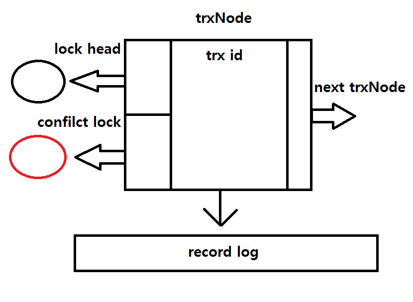
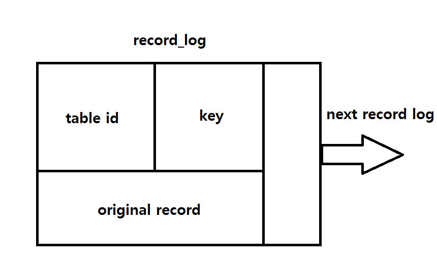
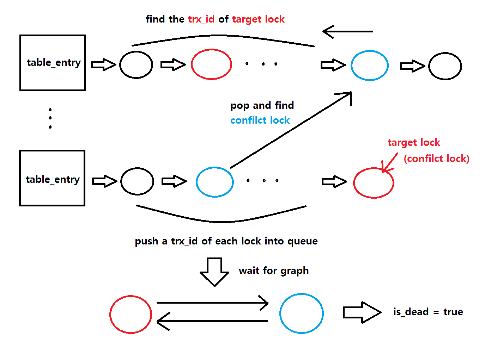
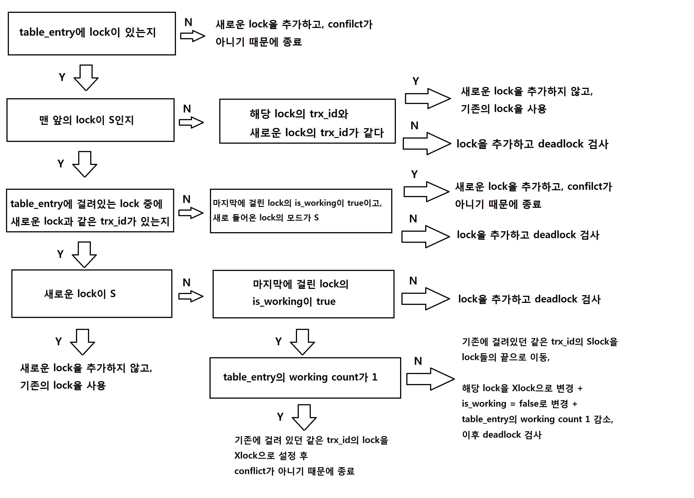
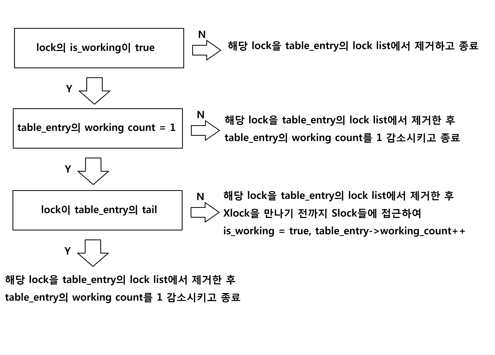

Introduce
==========
Concurrency Control의 구현에 대한 설명입니다.   
   
이번 프로젝트부터는 여러 Thread들마다 transaction을 사용하여 DB를 사용하게 되고,   
각각의 transaction은 trx_begin함수의 호출로 시작하여 trx_commit함수의 호출로 끝나게 됩니다.      
   
begin과 commit 사이에서는 db_find와 db_update API를 사용하여 원하는 테이블의 레코드를 찾거나 변경하게 됩니다.   
그러나 db_find와 db_update 사용 중 오류가 발생하면 트랜잭션은 이 함수들의 내부에서 abort됩니다.   
   
시스템 내부적으로는 Concurrency Control을 위해서 Strict 2 Phase Locking을 사용하여 트랜잭션들의 lock을 관리하고,   
트랜잭션이 새로운 lock을 추가할 때마다 deadlock 여부를 판단하여 abort할 지, operation을 진행할 지 결정합니다.   
또한 lock은 record단위로 생성하게 됩니다.   
   
Features
========
* [Transaction Manager](#transaction-manager)
* [Lock](#lock)
* [Other Modification](#other-modification)

Transaction Manager
====================
트랜잭션들을 관리하고, 트랜잭션과 관련된 API를 제공하는 Transaction Manager입니다.   
   
각 트랜잭션들의 정보를 설정하거나 불러오는데 쓰이는 trxManager객체와   
트랜잭션을 사용하기 위해 쓰이는 trx_begin, trx_commit 등과 같은 함수들이 정의되어있습니다.   
   
* [Introduce](#introduce)
* [Functions of Transaction Manager](#functions-of-transaction-manager)
* [API](#api)

> #### Introduce
트랜잭션이 새롭게 생성될 때마다 해당 트랜잭션은 id를 부여받습니다.    
트랜잭션의 id는 1부터 시작하며 새로운 트랜잭션은 마지막으로 생성되었던 트랜잭션 id에 1을 더한 값을 id로 할당받습니다.    
   
트랜잭션이 생성되면 그에 대응하는 trxNode가 생성됩니다. trxNode는 해당 트랜잭션에 대한 다양한 정보를 가지고 있습니다.  
   

   
트랜잭션이 lock을 생성하고 lock manager에 걸릴 떄마다 해당 lock은 trxNode의 lock head에 추가되게 됩니다.   
   
또한 트랜잭션이 db_find나 db_update 도중 lock을 얻지 못하고 대기 상태가 되는 confilct이 일어나면 해당 트랜잭션은 잠들게 되고,   
confilct이 풀리게 되어야 트랜잭션은 잠에서 깨어나 일하게 됩니다.   
      
즉 하나의 트랜잭션당 confilct이 발생한 lock은 존재하거나, 존재하지 않거나 두가지 상태를 유지하게 됩니다.   
confilct lock은 confilct이 발생한 lock을 가리킵니다. lock head로 표현되는 lock list와는 별개의 포인터입니다.   
   
next trxNode는 trxManager가 trxNode를 해쉬테이블 형태로 관리하기 위해 사용되는 포인터입니다.    
해쉬 테이블 상 next trxNode를 가리팁니다.   
   
record log는 해당 트랜잭션이 현재까지 변경해온 레코드들의 기록을 담고 있습니다.   
trxNode는 레코드들의 record log 객체들을 해쉬테이블 형태로 관리합니다.   
   

   
record_log 객체는 어떤 table id의 무슨 key에 대한 record인지를 구별하기 위한 정보를 가지고,   
trxNode가 record_log 객체를 해쉬 테이블 형태로 관리하기 때문에 이를 위한 next record_log를 가집니다.   
   
또한 record_log 객체는 original_value라는 변수를 가지고 트랜잭션이 변경하기 이전의 레코드를 담고 있습니다.    
즉, 트랜잭션이 첫 번째 db_update를 호출하는 시점에 저장되어있던 레코드를 가집니다.   
   
* ### trx_manager_latch
trxManager에는 동시에 여러 스레드들이 접근하여 정보가 제대로 반영되지 못하거나 잘못된 정보를 가져갈 위험이 있습니다.   
그렇기 때문에 trxManager의 정보를 업데이트할 때에는 trx_manager_latch라는 mutex를 통해 관리합니다.   
    
> #### Functions of Transaction Manager
   
trxManager가 사용하는 함수들에 대한 설명입니다.   
      
* ### int trxManager::set_new_trxNode()
새로운 trxNode 객체를 생성하고 trxManager의 해쉬 테이블에 추가합니다.   
   
해당 trxNode 객체는 trxManager가 내부적으로 저장하고 있던 trx id를 할당받습니다.   
id의 할당이 끝나면 trxManager는 다음 트랜잭션을 위해 저장하고 있던 id를 1 증가시킵니다.   
   
trxNode가 할당받은 trx id를 반환합니다.   
   
* ### trxNode* trxManager::get_trxNode(int trx_id)
인자로 받은 trx_id에 해당하는 trxNode의 주소값을 반환하는 함수입니다.   
   
* ### int trxManager::delete_trxNode(int trx_id)   
인자로 받은 trx_id에 해당하는 trxNode를 trxManager가 관리하는 해쉬 테이블에서 제거하는 함수입니다.   
   
* ### void trxManager::store_original_log(int trx_id, int table_id, int64_t key, char* original)
인자로 받은 trx_id에 해당하는 trxNode에 orignal한 record를 저장하기 위한 함수입니다.   
table_id와 key, orignal record를 담은 record_log를 만들고 trxNode가 관리하는 record_log 해쉬 테이블에 저장합니다.   
   
만약 해당하는 record_log가 이미 trxNode의 record_log 해쉬 테이블에 존재한다면 중복된 저장을 하지 않고 함수를 종료하고,   
해당 record_log가 아예 처음 생긴 record_log인 경우에만 해쉬테이블에 저장합니다.   
    
* ### record_log* trxManager::load_log(int trx_id, int table_id, int64_t key)
인자로 받은 trx_id의 trxNode가 관리하는 record_log의 주소값을 반환합니다.   
   
> #### API
* ### int init_trxManager()
trxManager 객체의 초기화를 위한 함수입니다. init_db함수의 내부에서 호출됩니다.   
   
* ### bool is_dead(lock_t* target)
<pre>
<code>
bool is_dead(lock_t* target){
    queue<int> q;
    hash_pass_trx_id pass;

    lock_t* c = target->prev;
    while(c != NULL){
        if (c->trx_id != target->trx_id){
            q.push(c->trx_id);
        }
        c = c->prev;
    }
    
    int front_trx_id;
    while(!q.empty()){
        front_trx_id = q.front();
        q.pop();

        if (pass.is_in(front_trx_id)){
            continue;
        }

        lock_t* next_target = trx_manager->get_trxNode(front_trx_id)->lock_conflict;
        if (next_target == NULL){
            pass.insert_id(front_trx_id);
            continue;
        }
        
        c = next_target->prev;
        while(c != NULL){
            if (c->trx_id == target->trx_id){
                return true;
            }
            if (!(pass.is_in(c->trx_id))){
                q.push(c->trx_id);
            }
            c = c->prev;
        }
        pass.insert_id(front_trx_id);
    }
    return false;
}
</code>
</pre>
인자로 받은 lock으로 인해 deadlock이 발생했는 지 확인하는 함수입니다.   
   

   
추가로, 인자로 들어온 lock에 대해 사이클이 형성되었는 지 확인이 끝난 trx_id는 따로 해쉬 자료구조로 보관해놓습니다.   
그래서 이미 확인이 끝난 trx_id에 대한 사이클을 중복해서 다시 검사하는 일이 발생하지 않도록 합니다.   
    
* ### int trx_rollback(int trx_id, int table_id, int64_t key)
인자로 받은 trx_id, table_id, key에 해당하는 record를 record_log에 저장되어있던 original record로 되돌리는 함수입니다.   
   
* ### void trx_abort(int trx_id)
인자로 받은 trx_id에 해당하는 트랜잭션을 abort시키는 함수입니다. trx_manager_latch를 얻어야 하는 함수입니다.   
   
> 내부적으로 lock들을 release시키기 떄문에 lock_table_latch도 필요하지만, trx_abort가 호출되는 lock_acquire함수가   
> 이미 lock_table_latch를 보유하고 있기 때문에 trx_abort 내부에서는 lock_table_latch를 얻지 않습니다.   
     
trxNode의 lock head로 표현되는 lock list에 담긴 lock들을 release시키며 해당 lock의 mode가 X이고, update를 성공한 lock이라면   
trx_rollback함수를 호출하여 record를 복구시킵니다.   
   
lock list의 모든 lock이 release되면 delete_trxNode함수를 이용해 trxNode를 제거합니다.   
   
* ### int trx_begin()
<pre>
<code>
int trx_begin(){
    pthread_mutex_lock(&trx_manager_latch);
    int trx_id = trx_manager->set_new_trxNode();
    if (trx_id == 0){
        pthread_mutex_unlock(&trx_manager_latch);
        return 0;
    }
    pthread_mutex_unlock(&trx_manager_latch);
    return trx_id;
}
</code>
</pre>
트랜잭션을 시작할 때 호출하는 함수입니다. trx_manager_latch를 얻어야 하는 함수입니다.   
   
set_new_trxNode함수를 이용해 새로운 trxNode를 할당받고 성공시 해당 trxNode의 trx_id를 반환합니다.   
실패시에는 0을 반환합니다.   
   
* ### int trx_commit(int trx_id)
<pre>
<code>
int trx_commit(int trx_id){
    pthread_mutex_lock(&lock_table_latch);
    pthread_mutex_lock(&trx_manager_latch);
    trxNode* target_trx = trx_manager->get_trxNode(trx_id);
    if (target_trx == NULL){
        pthread_mutex_unlock(&trx_manager_latch);
        return 0;
    }
    lock_t* c = target_trx->lock_head;
    lock_t* del;
    
    while(c != NULL){
        del = c;
        c = c->next_lock;
        
        lock_release(del);
    }
    pthread_mutex_unlock(&trx_manager_latch);
    pthread_mutex_unlock(&lock_table_latch);
    
    return trx_manager->delete_trxNode(trx_id);
}
</code>
</pre>
트랜잭션을 commit할 때 호출하는 함수입니다. trx_manager_latch와 lock_table_latch를 얻어야 하는 함수입니다.   
   
인자로 받은 trx_id의 trxNode가 가진 lock list에 담겨있는 모든 lock을 release 시키고   
delete_trxNode함수를 이용해 trxNode를 제거합니다.   
   
Lock
====
project4에서 만들었던 lock manager를 다시 사용하지만 일부 수정사항이 생겼습니다.   
   
* [lock_t & table_entry](#lock_t-&-table_entry)
* [lock_acquire](#lock_acquire)
* [lock_release](#lock_release)
   
> #### lock & table_entry

* ### lock_t
lock_t 구조체에 추가적인 정보들이 생겼습니다.   
   
lock_mode_t lock_mode;   
lock_t* next_lock = NULL;   
int trx_id;    
bool is_working = false;   
   
lock_mode는 lock이 S모드(읽기)인지, X모드(쓰기)인지 구별하는 용도입니다. 
> S는 0으로 X는 1로 설정되어있습니다.   
   
next_lock은 trxNode의 lock list를 링크드 리스트 형태로 관리하기 위한 변수입니다.    
   
trx_id는 해당 lock을 어떤 트랜잭션이 보유한 것인지 파악하기 위함입니다.    
   
is_working은 해당 lock을 가진 스레드가 레코드에 대해 원하는 결과를 얻었는지를 알 수 있게 해줍니다.     
> is_working이 true이어도 해당 lock을 가진 스레드는 wait일 수 있습니다.   
>   
> 예를 들어 어떤 스레드가 record A에 대해서 Xlock을 획득하여 레코드를 변경하면 해당 lock의 is_working은 true입니다.   
> 그러나 record B에서 confilct가 발생하여 스레드가 wait하면 해당 스레드는 잠들었지만   
> record A의 Xlock이 가진 is_working은 여전히 true입니다. 
   
* ### table_entry
table_entry 구조체에 추가적인 정보가 생겼습니다.   
   
int working_count = 0;   
   
해당 talbe_entry에 대해서 현재 몇 개의 lock이 원하는 결과를 얻고 있는 지를 나타내는 변수입니다.
   
> #### lock_acquire
lock의 모드가 추가되었기 때문에 변경이 생겼습니다.   
lock_table_latch를 얻고 새로운 lock을 만든 후 table_entry에 거는 것은 비슷하지만 내부적으로 다양한 경우의 수를 처리해야합니다.
<pre>
<code>
lock_t* lock_acquire(int table_id, int64_t key, int trx_id, int lock_mode)
{
	pthread_mutex_lock(&lock_table_latch);
	
	table_entry* target_entry = lock_table_ptr->find_table_entry(table_id, key);

	lock_t* new_lock = new lock_t;
	if(new_lock == NULL){
		pthread_mutex_unlock(&lock_table_latch);
		return NULL;
	}
	new_lock->sentinel_ptr = target_entry;
	new_lock->cond = PTHREAD_COND_INITIALIZER;
	
	new_lock->lock_mode = lock_mode;
	new_lock->trx_id = trx_id;
	if(target_entry->head == NULL){
		target_entry->head = new_lock;
		target_entry->tail = new_lock;
		
		target_entry->working_count++;
		new_lock->is_working = true;

		new_lock->next_lock = trx_manager->get_trxNode(trx_id)->lock_head;
		trx_manager->get_trxNode(trx_id)->lock_head = new_lock;

		pthread_mutex_unlock(&lock_table_latch);
		return target_entry->head;
	}
	else if (target_entry->head->lock_mode == X){
		if (target_entry->head->trx_id == trx_id){
			delete new_lock;
			pthread_mutex_unlock(&lock_table_latch);
			return target_entry->head;
		}
		else{
			target_entry->tail->next = new_lock;
			new_lock->prev = target_entry->tail;
			target_entry->tail = new_lock;

			new_lock->next_lock = trx_manager->get_trxNode(trx_id)->lock_head;
			trx_manager->get_trxNode(trx_id)->lock_head = new_lock;
			trx_manager->get_trxNode(trx_id)->lock_conflict = new_lock;
		}

	}
	else{
		bool is_working = false;
		lock_t* c = target_entry->head;
		while(c != NULL && c->lock_mode == S){
			if (c->trx_id == trx_id){
				is_working = true;
				break;
			}
			c = c->next;
		}
		
		if (is_working){

			if (lock_mode == S){
				delete new_lock;
				pthread_mutex_unlock(&lock_table_latch);
				return c;
			}
			else if (target_entry->tail->is_working){
				if (target_entry->working_count == 1){
					target_entry->head->lock_mode = X;
					delete new_lock;
					pthread_mutex_unlock(&lock_table_latch);
					return target_entry->head;
				}
				else{
					if (target_entry->tail != c){
						if (target_entry->head == c){
							c->next->prev = NULL;
							target_entry->head = c->next;
						}
						else{
							c->next->prev = c->prev;
							c->prev->next = c->next;
						}
						target_entry->tail->next = c;
						c->prev = target_entry->tail;
						c->next = NULL;
						target_entry->tail = c;
					}
					target_entry->tail->lock_mode = X;
					target_entry->tail->is_working = false;
					target_entry->working_count--;

					delete new_lock;
					
					new_lock = target_entry->tail;
					trx_manager->get_trxNode(trx_id)->lock_conflict = target_entry->tail;
				}
			}
			else{
				
				target_entry->tail->next = new_lock;
				new_lock->prev = target_entry->tail;
				target_entry->tail = new_lock;

				new_lock->next_lock = trx_manager->get_trxNode(trx_id)->lock_head;
				trx_manager->get_trxNode(trx_id)->lock_head = new_lock;
				trx_manager->get_trxNode(trx_id)->lock_conflict = new_lock;
			}

		}
		else{
			if (target_entry->tail->is_working && lock_mode == S){
				target_entry->tail->next = new_lock;
				new_lock->prev = target_entry->tail;
				target_entry->tail = new_lock;

				target_entry->working_count++;
				new_lock->is_working = true;

				new_lock->next_lock = trx_manager->get_trxNode(trx_id)->lock_head;
				trx_manager->get_trxNode(trx_id)->lock_head = new_lock;

				pthread_mutex_unlock(&lock_table_latch);
				return new_lock;
			}
			else{
				target_entry->tail->next = new_lock;
				new_lock->prev = target_entry->tail;
				target_entry->tail = new_lock;

				new_lock->next_lock = trx_manager->get_trxNode(trx_id)->lock_head;
				trx_manager->get_trxNode(trx_id)->lock_head = new_lock;
				trx_manager->get_trxNode(trx_id)->lock_conflict = new_lock;
			}

		}

	}
	if (is_dead(new_lock)){
		trx_abort(trx_id);
		pthread_mutex_unlock(&lock_table_latch);
		return NULL;
	}
	
	pthread_cond_wait(&(new_lock->cond), &lock_table_latch);
	trx_manager->get_trxNode(trx_id)->lock_conflict = NULL;

	pthread_mutex_unlock(&lock_table_latch);
	
	return new_lock;
}
</code>
</pre>
   

   
위와 같은 과정을 거치게 되면 deadlock검사를 안하고 마무리 되는 경우와 daedlock 검사를 해야하는 경우로 나뉩니다.   
   
deadlock검사를 해서 is_dead가 true로 나온다면 trx_abort를 진행하고,   
그렇지 않다면 해당 스레드는 잠들게 됩니다.   
   
나중에 wait로부터 풀려나게 되면 confilct가 해결되었다는 의미이기 때문에 trxNode의 lock_confilct를 NULL로 설정하고
종료합니다.   
   
> #### lock_release
이전과 다르게 lock_table_latch를 얻지 않습니다.   
그 이유는 lock_release를 호출하는 함수는 trx_abort, trx_commit인데 이 함수들은 이미 lock_table_latch를 얻은 상태이기 때문입니다.   
   
또한 lock mode의 추가로 인해 Slock들끼리는 서로 confilct하지 않아서 여러 lock의 스레드를 깨우는 상황을 추가하게 되었습니다.   
<pre>
<code>
int lock_release(lock_t* lock_obj)
{
	table_entry* target_entry = lock_obj->sentinel_ptr;

	if (lock_obj->is_working){
		if (target_entry->working_count == 1){
			
			target_entry->head = lock_obj->next;
			if (lock_obj == target_entry->tail){
				target_entry->tail = NULL;
				target_entry->working_count--;
			}
			else{
				target_entry->head->prev = NULL;

				lock_t* c = target_entry->head;
				c->is_working = true;
				pthread_cond_signal(&(c->cond));
					
				if (c->lock_mode == S){
					c = c->next;
					while(c != NULL && c->lock_mode != X){
						target_entry->working_count++;
						c->is_working = true;
						pthread_cond_signal(&(c->cond));
						c = c->next;
					}
				}
			}
		}
		else{
			if (lock_obj == target_entry->head){
				target_entry->head = lock_obj->next;
			}
			if (lock_obj == target_entry->tail){
				target_entry->tail = lock_obj->prev;
			}

			if (lock_obj->prev != NULL){
				lock_obj->prev->next = lock_obj->next;
			}
			if (lock_obj->next != NULL){
				lock_obj->next->prev = lock_obj->prev;
			}

			target_entry->working_count--;
		}
	}
	else{
		lock_obj->prev->next = lock_obj->next;
		if (lock_obj->next != NULL){
			lock_obj->next->prev = lock_obj->prev;
		}
		else{
			target_entry->tail = lock_obj->prev;
		}
	}
	
	delete lock_obj;
	
	return 0;
}
</code>
</pre>

   
Other Modification
==================
Concurrency Control을 구현하게 되면서 버퍼 매니저와 인덱스 매니저에도 변경이 생겼습니다.   
   
* [Buffer Manager](#buffer-manager)
* [Index Manager](#index-manager)
   
> #### Buffer Manager   
   
* buffer_latch
LRU policy에 의하여 버퍼 풀에 변경이 생길 때, 서로 다른 스레드들이 같은 버퍼 구조체에 접근하게 되는 경우를 방지하기 위해서   
스레드들이 버퍼 구조체에 접근하여 LRU 리스트를 변경하려면 먼저 buffer_latch라는 mutex를 얻은 후 접근할 수 있습니다.   
   
* ### page_latch 
이번 프로젝트에서는 버퍼 구조에체 pin 대신 page_latch를 활용합니다.   
스레드가 버퍼 래치를 얻고 페이지 접근에 성공하면 다른 스레드가 해당 페이지에 접근 못하도록 page_latch를 얻어야 합니다.   
page_latch를 얻은 후에는 buffer_latch를 놓아주게 됩니다.    
   
* ### bufStack_latch   
버퍼 매니저의 함수들을 사용할 때는 비어있는 버퍼 구조체의 위치를 담은 bufStack을 사용해야하는 경우가 생깁니다.   
해당 객체에도 mutex를 할당하여 여러 스레드가 동시에 접근하지 못하게 하였습니다.   
   
* ### bufHash_latch 
버퍼 매니저의 함수들을 사용할 때는 현재 사용하고 있는 버퍼 구조체의 위치를 담은 bufHash을 사용해야하는 경우가 생깁니다.   
해당 객체에도 mutex를 할당하여 여러 스레드가 동시에 접근하지 못하게 하였습니다.   
   
버퍼 매니저가 가진 함수들의 내부에서는 위와 같은 latch들을 사용하여 여러 스레드들의 접근을 제한합니다.   
   
* ### buffer_read_page
버퍼 래치를 얻고 LRU 리스트를 먼저 수정해줍니다. 그 다음 페이지 래치를 얻고 마지막에 버퍼 래치를 풀어줍니다.   
   
* ### buffer_complete_read_without_write, buffer_write
보유중인 페이지 래치를 풀어줍니다.   
    
> #### Index Manager
추가적인 API인 db_update가 생겼고, db_find에 대해서 여러 트랜잭션을 다루기 위한 변화가 생겼습니다.   
또한 여러 스레드들의 접근을 다루기 위해 table_id를 관리하는 tableManager_latch도 추가되었습니다.   
   
* ### int db_find(int table_id, int64_t key, char* ret_val, int trx_id)
<pre>
<code>
int db_find(int table_id, int64_t key, char* ret_val, int trx_id) {
	if (tableManager->get_fileTable(table_id)->getFd() < 0){
		return -1;
	}
	HeaderPage headerPage;
	LeafPage target_leafPage;
	
	buffer_read_page(table_id, 0, &headerPage);
	buffer_complete_read_without_write(table_id, 0);
	
	if (headerPage.root_pageNum == 0) {
		return -1;
	}
	pagenum_t leafPageNum = find_leafPage(table_id, headerPage.root_pageNum, key);
	buffer_read_page(table_id, leafPageNum, &target_leafPage);

	int i = search_index_location_leaf(target_leafPage.record, key, target_leafPage.num_keys);
	if (i == -1) {
                buffer_complete_read_without_write(table_id, leafPageNum);
      
                pthread_mutex_lock(&lock_table_latch);
                trx_abort(trx_id);
                pthread_mutex_unlock(&lock_table_latch);

		return -1;
	}

	buffer_complete_read_without_write(table_id, leafPageNum);
	if (lock_acquire(table_id, key, trx_id, S) == NULL){
		return -1;
	}

	buffer_read_page(table_id, leafPageNum, &target_leafPage);
	strcpy(ret_val, target_leafPage.record[i].value);
	buffer_complete_read_without_write(table_id, leafPageNum);

	return 0;
}
</code>
</pre>
이전의 db_find와 달라진 점은 페이지를 buffer_read로 읽은 후, 레코드를 바로 얻는 것이 아니라   
해당 레코드의 위치를 파악한 후 buffer_complete_read_witout_write로 페이지 래치를 풀어주고, lock_acquire를 기다립니다.   
   
만약 find하고자 하는 key가 페이지 상에 존재하지 않는다면 페이지에 대한 래치를 먼저 풀어주고 해당 트랜잭션을 abort합니다.    
   
trx_abort 내부에서는 lock_table_latch를 얻지 않기 때문에 lock_table_latch를 먼저 얻고 동작을 수행합니다. -1을 반환합니다.   
   
이후 Slock을 얻게 되면 다시 buffer_read로 페이지를 읽어서 레코드를 찾은 후에 페이지 래치를 풀어주고 0을 리턴합니다.   
   
lock을 얻지 못했다면 -1을 리턴합니다.   
   
* ### int db_update(int table_id, int64_t key, char* values, int trx_id)
<pre>
<code>
int db_update(int table_id, int64_t key, char* values, int trx_id){
	if (tableManager->get_fileTable(table_id)->getFd() < 0){
		return -1;
	}

	HeaderPage headerPage;
	LeafPage target_leafPage;

	buffer_read_page(table_id, 0, &headerPage);
	buffer_complete_read_without_write(table_id, 0);
	if (headerPage.root_pageNum == 0) {
		return -1;
	}
	pagenum_t leafPageNum = find_leafPage(table_id, headerPage.root_pageNum, key);
	buffer_read_page(table_id, leafPageNum, &target_leafPage);

	int i = search_index_location_leaf(target_leafPage.record, key, target_leafPage.num_keys);
	if (i == -1) {
                buffer_complete_read_without_write(table_id, leafPageNum);
      
                pthread_mutex_lock(&lock_table_latch);
                trx_abort(trx_id);
                pthread_mutex_unlock(&lock_table_latch);

		return -1;
	}

	buffer_complete_read_without_write(table_id, leafPageNum);

	if (lock_acquire(table_id, key, trx_id, X) == NULL){
		return -1;
	}
	
	buffer_read_page(table_id, leafPageNum, &target_leafPage);
	trx_manager->store_original_log(trx_id, table_id, key, target_leafPage.record[i].value);
	strcpy(target_leafPage.record[i].value, values);
	buffer_write_page(table_id, leafPageNum, &target_leafPage);

	return 0;
}
</code>
</pre>
db_find와 마찬가지로 먼저 페이지를 buffer_read로 읽은 후, 레코드를 바로 얻는 것이 아니라   
해당 레코드의 위치를 파악한 후 buffer_complete_read_witout_write로 페이지 래치를 풀어주고, lock_acquire를 기다립니다.    
   
만약 find하고자 하는 key가 페이지 상에 존재하지 않는다면 페이지에 대한 래치를 먼저 풀어주고 해당 트랜잭션을 abort합니다.    
trx_abort 내부에서는 lock_table_latch를 얻지 않기 때문에 lock_table_latch를 먼저 얻고 동작을 수행합니다. -1을 반환합니다.   
   
이후 Xlock을 얻게 되면 다시 buffer_read로 페이지를 읽어서 레코드를 찾은 후에 original한 레코드를 trxNode에 저장해주고   
해당 레코드를 변경한 후 0을 반환합니다.   
      
lock을 얻지 못했다면 -1을 리턴합니다.   