# Implement of Disk based b+tree
Disk based b+tree의 구현에 대하여 설명하겠습니다.   
사용한 언어는 c++이고, 리눅스 운영체제에서 g++ 7.5.0을 사용하여 컴파일되었습니다.   

# Features
1. File Manager API
2. Disk based b+tree
3. Makefile

### 1. File Manager API
+ Introduce
+ Header file
+ API

> ### Introduce
File Manager 계층 및 Disk space Manager 계층이 담당하는 API에 대한 구현입니다.   
파일에 직접 접근하게 되는 Layer입니다.   

> ### Header file
File Manager를 구현하기 위해 작성된 헤더파일 코드입니다.   
명칭은 file.h이며 부분적으로 코드를 나눠가며 설명하겠습니다.   
또한 정의된 구조체들의 멤버는 기본적으로 0으로 초기화시켰습니다.   
   
* #### 매크로 변수 및 기본 자료형 정의
<pre>
<code>
#pragma once
#include &#60stdint.h&#62

#define PAGE_SIZE 4096
#define NEW_FREEPAGE_NUM 1024

typedef uint64_t pagenum_t;
struct page_t {};
</code>
</pre>
64비트 정수 자료형을 사용할 수 있기 위해 stdint.h 헤더파일을 include합니다.   
매크로 변수로 정의된 PAGE_SIZE는 페이지의 크기를 의미하며 4026바이트가 할당되게 됩니다.   
NEW_FREEPAGE_NUM은 Free Page를 새로 할당할 때 1024개씩 추가하겠다는 의미입니다.   
   
페이지 넘버는 uint64_t 자료형을 사용하고 pagenum_t라는 명칭을 사용합니다.    
page_t 구조체는 디스크 상의 페이지를 메모리로 가져올 때 사용되는 구조체입니다.   

* #### 페이지 내부에서 사용되는 구조체
<pre>
<code>
typedef struct Record {
	int64_t key = 0x00;
	char value[120] = {0x00};
}Record;

typedef struct Node {
	int64_t key=0x00;
	pagenum_t pageNum=0x00;
}Node;
</code>
</pre>
Record 구조체는 Leaf Page에 존재하는 구조체입니다.   
key와 value에 대한 정보를 가지며 key는 int64_t를 사용하며 8바이트의 크기를 가지고,   
이에 대응하는 value는 최대 120바이트까지 문자열을 쓸 수 있습니다.   
   
Node 구조체는 Internal Page에 존재하는 구조체입니다.   
key와 이보다 큰 key들을 가진 페이지의 넘버를 나타내는 pageNum변수로 구성되어있습니다.   

* #### in-memory page를 위한 페이지 구조체
페이지 종류마다 내부구조가 다르기 때문에 그에 맞춰 각각 구조체를 정의해야합니다.   
**그러나 API에 인자로 들어오는 페이지 구조체는 page_t로 고정되어있기 때문에 각 페이지 구조체들은 모두 page_t를 상속받습니다.**   
   
<pre>
<code>
struct HeaderPage : public page_t {
	pagenum_t free_pageNum=0x00;
	pagenum_t root_pageNum=0x00;
	int64_t num_page=0x00;
	int reserved[1018] = { 0x00 };
};
</code>
</pre>
Header 페이지를 위한 구조체입니다.   
첫번째 Free 페이지 넘버를 가리키는 변수인 free_pageNum, Root 페이지 넘버를 가리키는 변수인 root_pageNum,   
Header 페이지를 포함하여 파일 내에 존재하는 모든 페이지의 개수를 나타내는 num_page변수를 멤버로 가졌습니다.      
또한 4096바이트의 크기를 갖기 위해 남은 공간을 reserved라는 int 배열을 1018칸만큼 할당하였습니다.   
   
<pre>
<code>
struct FreePage : public page_t {
	pagenum_t next_free_pageNum=0x00;
	int reserved[1022] = { 0x00 };
};
</code>
</pre>
Free 페이지를 위한 구조체입니다.   
다음 Free 페이지 넘버를 가리키는 next_free_pageNum 변수를 가지고,   
페이지 크기를 맞추기 위해 남은 공간을 reserved라는 int 배열을 1022칸 할당하였습니다.   

<pre>
<code>
struct InternalPage : public page_t {
	pagenum_t parent_pageNum=0x00;
	int isLeaf=0x00;
	int num_keys=0x00;
	int reserved[26] = { 0x00 };
	pagenum_t farLeft_pageNum=0x00;
	Node node[248] = {0x00};
};
</code>
</pre>
Internal 페이지를 위한 구조체입니다.
부모 페이지 넘버를 가리키는 parent_pageNum 변수, Leaf 페이지라면 1 아니면 0을 가지는 isLeaf변수,   
페이지 내에 들어있는 key의 개수를 담은 num_keys, 해당 페이지의 자식페이지 중 가장 왼쪽 페이지의 넘버를 가리키는 farLeft_pageNum,   
key와 pagenum정보를 담은 Node를 배열형태로 248개 할당받았습니다.   
페이지 크기를 맞추기 위해 reserved라는 int 배열을 26칸 할당하였습니다.

<pre>
<code>
struct LeafPage : public page_t {
	pagenum_t parent_pageNum=0x00;
	int isLeaf=0x00;
	int num_keys=0x00;
	int reserved[26] = { 0x00 };
	pagenum_t sibling_pageNum=0x00;
	Record record[31] = {0x00};
};
</code>
</pre>
Leaf 페이지를 위한 구조체입니다.
부모 페이지 넘버를 가리키는 parent_pageNum 변수, Leaf 페이지라면 1 아니면 0을 가지는 isLeaf변수,   
페이지 내에 들어있는 key의 개수를 담은 num_keys, 해당 페이지의 오른쪽 Leaf 페이지를 가리키는 sibling_pageNum,   
key와 value정보를 담은 Record를 배열형태로 31개 할당받았습니다.   
페이지 크기를 맞추기 위해 reserved라는 int 배열을 26칸 할당하였습니다.

   
> ### API
Header file을 기반으로 File Manager의 API를 직접적으로 구현한 코드입니다.   
명칭은 file.cpp입니다.   

* #### include 및 변수 설명
<pre>
<code>
#include "file.h"
#include &#60fcntl.h&#62
#include &#60unistd.h&#62

int fd = -1;
</code>
</pre>
file.h를 include하였고, 시스템 콜을 사용하기 위해 fcntl.h와 unistd.h를 include하였습니다.   
fd는 file descriptor를 나타내기 위한 변수입니다. 기본적으로 -1로 초기화되어있습니다.   

* #### open_file
<pre>
<code>
void open_file(char* path) {
	fd = open(path, O_RDWR | O_CREAT, 00700);
}
</code>
</pre>
open 시스템 콜을 사용하여 파일을 여는 함수입니다. read권한과 write권한을 가지며 파일이 존재하지 않다면 새롭게 파일을 생성하는 함수입니다.   
성공 시 fd에 해당 파일의 file descriptor를 저장하고 오류가 났다면 -1을 저장하게 됩니다.   

* #### file_read_page
<pre>
<code>
void file_read_page(pagenum_t pagenum, page_t* dest) {
	lseek(fd, pagenum * PAGE_SIZE, 0);
	read(fd, dest, PAGE_SIZE);
}
</code>
</pre>
lseek를 사용하여 인자로 받은 페이지 넘버가 위치해야하는 오프셋으로 이동한 후,    
페이지의 크기만큼 디스크에 존재하는 데이터를 읽어서 메모리 상의 dest가 가리키는 페이지 구조체에 저장합니다.   

* #### file_write_page
<pre>
<code>
void file_write_page(pagenum_t pagenum, const page_t* src) {
	lseek(fd, pagenum * PAGE_SIZE, 0);
	if (write(fd, src, PAGE_SIZE) == PAGE_SIZE){
		fsync(fd);
	}
}
</code>
</pre>
lseek를 사용하여 인자로 받은 페이지 넘버가 위치해야하는 오프셋으로 이동한 후,   
메모리 상의 src가 가리키는 페이지 구조체에 담긴 데이터를 페이지의 크기만큼 디스크에 입력하고,   
만약 제대로 입력이 되었다면 fsync함수를 통해 디스크와 동기화시킵니다.   

* #### file_alloc_page
<pre>
<code>
pagenum_t file_alloc_page() {
	HeaderPage headerPage;
	FreePage target_freePage;
	int allocated_pageNum;

	file_read_page(0, &headerPage);

	if (headerPage.free_pageNum == 0) {
		allocated_pageNum = headerPage.num_page;
		target_freePage.next_free_pageNum = 0;
		file_write_page(headerPage.num_page++, &target_freePage);

		headerPage.free_pageNum = headerPage.num_page;
		for (int i = 0; i < NEW_FREEPAGE_NUM - 2; i++) {
			target_freePage.next_free_pageNum = headerPage.num_page + 1;
			file_write_page(headerPage.num_page++, &target_freePage);
		}
		target_freePage.next_free_pageNum = 0;
		file_write_page(headerPage.num_page++, &target_freePage);

		file_write_page(0, &headerPage);

		return allocated_pageNum;
	}

	file_read_page(headerPage.free_pageNum, &target_freePage);
	allocated_pageNum = headerPage.free_pageNum;
	headerPage.free_pageNum = target_freePage.next_free_pageNum;
	target_freePage.next_free_pageNum = 0;
	file_write_page(0, &headerPage);

	return allocated_pageNum;
}
</code>
</pre>
Header 페이지가 가리키는 Free 페이지를 Free 페이지의 리스트에서 빼내고 해당 페이지 넘버를 반환해주는 함수입니다.   
Header 페이지가 가리키는 Free 페이지는 반환된 페이지가 가리키던 Free 페이지가 됩니다.   
   
만약 Free 페이지가 하나도 없다면 파일에 존재하는 마지막 페이지의 끝부터 NEW_FREEPAGE_NUM만큼의 Free 페이지를 생성하고,   
그 중 가장 먼저 생성된 Free 페이지를 제외한 나머지를 링크드 리스트 형태로 연결한 뒤 첫 번째로 생성된 Free 페이지의 넘버를 반환합니다.   
Header 페이지가 가리키는 Free 페이지는 두 번재로 생성된 Free 페이지가 됩니다.  
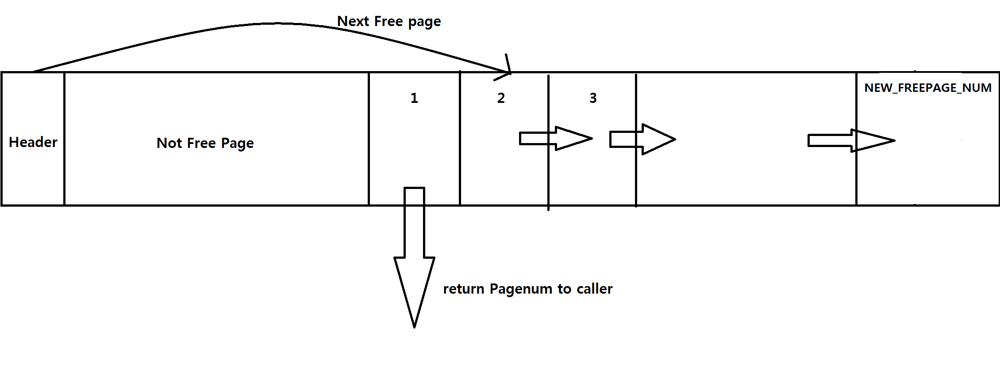

* #### file_free_page
<pre>
<code>
void file_free_page(pagenum_t pagenum) {
	if (pagenum == 0) {
		return;
	}

	HeaderPage headerPage;
	file_read_page(0, &headerPage);

	if (pagenum >= headerPage.num_page) {
		return;
	}

	FreePage target_page;
	file_read_page(pagenum, &target_page);

	target_page.next_free_pageNum = headerPage.free_pageNum;
	for (int i = 0; i < 1022; i++) {
		target_page.reserved[i] = 0;
	}
	headerPage.free_pageNum = pagenum;

	file_write_page(0, &headerPage);
	file_write_page(pagenum, &target_page);
}

void file_read_page(pagenum_t pagenum, page_t* dest) {
	lseek(fd, pagenum * PAGE_SIZE, 0);
	read(fd, dest, PAGE_SIZE);
}
</code>
</pre>
인자로 받은 페이지 넘버에 해당되는 페이지를 Free 페이지로 바꾼 뒤 Free 페이지 리스트에 넣는 함수입니다.   
Header 페이지가 가리키는 Free 페이지는 인자로 받은 페이지 넘버가 됩니다.   
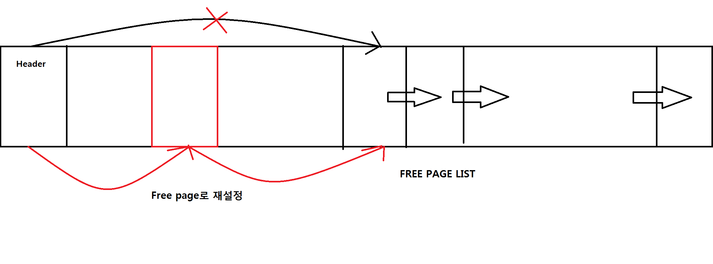

### 2. Disk based b+tree
+ Introduce
+ Header file
+ Commands

> ### Introduce
Index Manager에 해당되는 Disk based b+tree의 구현입니다.

> ### Header file
Disk based b+tree를 구현하기 위한 헤더 파일입니다.   
명칭은 bpt.h입니다.   

* #### include 및 매크로 변수
<pre>
<code>
#include "file.h"

#define MAX_KEY_LEAF 31
#define MAX_KEY_INTERNAL 248
</code>
</pre>
File Manager의 API를 사용하기 때문에 file.h를 include하였습니다.   
MAX_KEY_LEAF는 Leaf 페이지에 존재할 수 있는 key의 최대 개수를 의미하고 31로 지정하였습니다.   
MAX_KEY_INTERNAL은 Internal 페이지에 존재할 수 있는 key의 최대 개수를 의미하고 248로 지정하였습니다.   
> 코드 상으로 함수들의 선언 아래에 존재하는 treeNode와 같은 부분은 main에서 트리를 출력하는데에만 쓰이기 때문에 따로 서술하지 않았습니다.

> ### Commands
B+tree에 쓰이는 4가지의 명령들인 open_table, db_insert, db_find, db_delete에 대한 구현 및 이를 위한 함수들을 구현한 부분입니다.   
명칭은 bpt.cpp입니다.   

* #### include 및 변수
<pre>
<code>
#include <string.h>
#include "bpt.h"
#include <iostream>

using namespace std;

extern int fd;
</code>
</pre>
레코드의 value를 다루기 위해 string.h를 include하였고, 트리를 출력하기위해 iostream을 include하였습니다.   
bpt.h의 함수들을 구현하기 위해 bpt.h를 include하였고 file.cpp에서 할당되었던 fd를 extern을 이용하여 사용합니다.   

* #### open_table
<pre>
<code>
int open_table(char* path) {
	open_file(path);
	
	HeaderPage headerPage;
	file_read_page(0, &headerPage);
	if(headerPage.num_page == 0){
		headerPage.num_page = 1;
		headerPage.free_pageNum = 0;
		headerPage.root_pageNum = 0;
		file_write_page(0, &headerPage);
	}

	if (fd == -1) {
		return -1;
	}
	return fd;
}
</code>
</pre>
File Manager의 open_file함수를 이용하여 파일을 열고 Header 페이지를 확인합니다.   
Header 페이지조차 존재하지 않는다면 Header 페이지를 새롭게 만들어냅니다.   
파일을 여는 것에 실패했다면 -1을 반환하고, 성공했다면 fd를 반환합니다.   

* #### db_find
<pre>
<code>
int db_find(int64_t key, char* ret_val) {
	if (fd == -1){
		cout << "Table is closed" << endl;
		return -1;
	}

	HeaderPage headerPage;
	LeafPage target_leafPage;

	file_read_page(0, &headerPage);
	if (headerPage.root_pageNum == 0) {
		return -1;
	}
	pagenum_t leafPageNum = find_leafPage(headerPage.root_pageNum, key);
	file_read_page(leafPageNum, &target_leafPage);
	int i = search_index_location_leaf(target_leafPage.record, key, target_leafPage.num_keys);
	if (i == -1) {
		return -1;
	}
	strcpy(ret_val, target_leafPage.record[i].value);
	return 0;
}
</code>
</pre>
파일이 열려있지 않거나 인자로 들어온 key가 존재하지 않는다면 -1을 반환하고,   
key가 존재한다면 그에 대응하는 value를 인자로 들어온 ret_val에 저장한 후 0을 반환합니다.   

* #### find_leafPage
인자로 들어온 key가 존재해야하는 Leaf 페이지의 넘버를 반환합니다.   

* #### search_index_area_internal
Internal 페이지에서 인자로 들어온 key가 존재해야하는 페이지 넘버의 인덱스를 binary search를 기반으로 탐색하는 함수입니다.   
예를 들어
<pre>
     1     3     5      => key
 -1     0    1     2    => 반환값
</pre>
이와 같이 Internal 페이지가 존재한다는 가정하에   
찾고자 하는 key가   
1보다 작다면 -1을 반환하고, 1 이상 3미만이라면 0을 반환, 3이상 5미만이라면 1을 반환, 5이상이라면 2를 반환합니다.   

* #### search_index_area_leaf
위 함수와 작동방식이 동일하고 Leaf 페이지를 대상으로 하는 함수입니다.

* #### search_index_location_internal
Internal 페이지에서 인자로 들어온 key가 존재하는 정확한 위치의 인덱스를 binary search를 기반으로 탐색하는 함수입니다.
예를 들어  
<pre>
     1     3     5      => key
     0     1     2      => 반환값
</pre>
이와 같이 페이지가 존재하고 1을 찾는다면 0을 반환하고 3은 1을 반환, 5는 2를 반환하는 방식입니다.   
만약 존재하지 않는 값을 찾는다면 -1을 반환합니다.   

* #### search_index_location_leaf
위 함수와 작동방식이 동일하고 Leaf 페이지를 대상으로 하는 함수입니다.

* #### db_insert
<pre>
<code>
int db_insert(int64_t key, char* value){
	if(fd == -1){
		cout << "Table is closed" << endl;
		return -1;
	}

	char ret_val[120];
	if (db_find(key,ret_val) == 0){
		return -1;
	}
	
	Record new_record = make_record(key, value);

	HeaderPage headerPage;
	file_read_page(0, &headerPage);
	if (headerPage.root_pageNum == 0){
		make_new_tree(new_record);
		return 0;
	}

	pagenum_t leafPageNum = find_leafPage(headerPage.root_pageNum, key);
	LeafPage leafPage;
	file_read_page(leafPageNum, &leafPage);

	if (leafPage.num_keys < MAX_KEY_LEAF){
		int area = search_index_area_leaf(leafPage.record, new_record.key, leafPage.num_keys) + 1;
		int i;
		for(i = leafPage.num_keys; i > area; i--){
			leafPage.record[i] = leafPage.record[i-1];
		}
		leafPage.record[i] = new_record;
		leafPage.num_keys++;

		file_write_page(leafPageNum, &leafPage);
	}
	else{
		insert_into_leafPage_after_splitting(leafPageNum, new_record);
	}
	
	return 0;
}
</code>
</pre>
인자로 들어온 key와 value를 Leaf 페이지에 삽입하는 함수입니다.   
만약 파일이 열리지 않았거나 이미 존재하는 key라면 -1을 반환합니다.   
Leaf 페이지에 자리가 있다면 해당하는 자리에 Record형태로 입력하고 뒤에 Record들은 한칸씩 밀려납니다.   
만약 자리가 없다면 split을 합니다.   

* #### make_record
Record를 생성해내는 함수입니다.   

* #### make_new_tree
루트 페이지가 없다면 file_alloc_page를 이용하여 페이지를 할당받고 그 페이지를 루트 페이지로 사용하는 함수입니다.   
Header 페이지가 가리키는 루트 페이지 넘버도 갱신됩니다.   

* #### insert_into_leafPage_after_splitting
Leaf 페이지를 split하는 함수입니다.    
file_alloc_page를 통해 새로운 페이지를 할당받고 key를 분배한 후 새로운 페이지의 가장 작은 key가 부모 페이지에 복사됩니다.      
   
예를 들어 최대 key의 개수가 5라는 가정하에
   
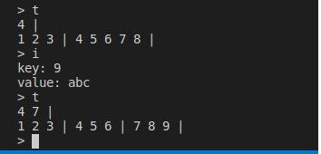   
   
이처럼 4,5,6,7,8에 9가 추가되어 split이 발생하고, 새로운 페이지의 가장 작은 key인 7이 복사되어 부모 페이지에 삽입됩니다. 
     
또한 새로운 Leaf 페이지가 생겨도 그에 맞춰 sibling관계가 유지됩니다.
밑의 이미지에 나오는 수의 배열은 Leaf 페이지의 제일 왼쪽의 key부터 제일 오른쪽 key까지 나열한 이미지입니다.   
+ split 이전   
   
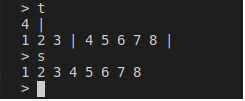
   
+ split 이후   
   
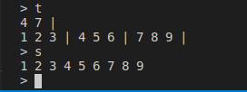

* #### cut
인자가 홀수면 2를 나눈 값 +1을 반환하고, 짝수면 2를 나눈 값을 반환합니다.   

* #### insert_into_parent
부모 페이지에 key를 삽입하는 함수입니다.   
만약 부모페이지가 존재하지 않는다면 새롭게 루트페이지를 만들어냅니다.   
또한 삽입할 자리가 없다면 해당 부모페이지를 split합니다.   

* #### insert_into_internalPage_after_splitting
Internal 페이지에 key를 삽입할 자리가 없을 때 split하는 함수입니다.   
Leaf 페이지를 split하는 것과 작동방식이 대부분 같지만     
Leaf 페이지와 다르게 key를 복사하지 않고 부모 페이지로 올려보낸다는 차이가 있습니다.   
   
예를 들어 key의 최대 개수가 5개라는 가정하에   
   
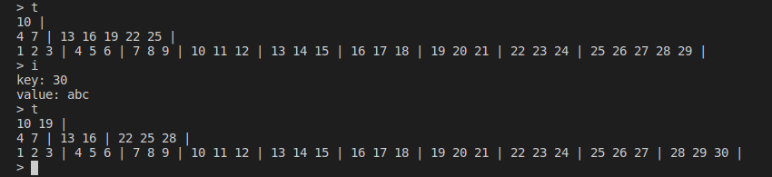   
   
Internal 페이지에 있던 13, 16, 19, 22, 25에 28이 추가되었고    
split이 발생하여 19가 부모페이지로 복사가 아닌 이동되었음을 확인할 수 있습니다.

* #### db_delete
<pre>
<code>
int db_delete(int64_t key){
	if (fd == -1){
		cout << "Table is closed" << endl;
		return -1;
	}

	pagenum_t key_leafPageNum;
	HeaderPage headerPage;
	file_read_page(0, &headerPage);

	if(headerPage.root_pageNum == 0){
		return -1;
	}

	char ret_val[120];
	if(db_find(key, ret_val) == 0){
		key_leafPageNum = find_leafPage(headerPage.root_pageNum, key);
		delete_entry(headerPage.root_pageNum, key_leafPageNum, key);
		return 0;
	}
	else{
		return -1;
	}
}
</code>
</pre>
파일이 열려있지 않거나 해당하는 key가 존재하지 않는다면 -1을 반환합니다.   
해당하는 key가 존재한다면 그에 대응하는 record를 삭제하고 0을 반환합니다.   

* #### remove_entry_from_page
만약 Leaf 페이지라면 해당하는 key와 value를 삭제하고   
Internal 페이지라면 key와 pagenum을 삭제합니다.   

* #### adjust_root
대상 페이지가 루트페이지이고 key가 모두 사라졌을 떄   
루트페이지가 Leaf페이지라면 file_free_page를 통해 페이지를 없애고
Internal 페이지라면 루트페이지를 왼쪽 자식 페이지로 재설정 후 기존의 페이지를 대상으로 file_free_page를 실행합니다.   

* #### delete_entry
remove_entry_from_page함수를 통해 페이지를 수정하고 만약 해당 페이지가 루트페이지라면 adjust_root함수를 실행합니다.   
기존의 b+tree와는 다르게 페이지의 key가 0개일 때만 structure modification을 수행합니다.    

> **Structure modification**   
> **만약 key의 개수가 0이된 페이지가 Internal 페이지이면서 이웃한 페이지의 key가 꽉 찼다면 redistribute을 실행하고   
그 외의 경우는 delayed Merge를 실행합니다.**  

* #### delayed_merge
<pre>
<code>
pagenum_t delayed_merge(pagenum_t targetPageNum, pagenum_t neighborPageNum, int targetPage_index, int64_t k_prime){
	InternalPage targetPage, parentPage;
	file_read_page(targetPageNum, &targetPage);

	pagenum_t parentPageNum = targetPage.parent_pageNum;
	file_read_page(parentPageNum, &parentPage);

	if (targetPage.isLeaf == 1){
		LeafPage targetPage_leaf, neighborPage_leaf;
		file_read_page(targetPageNum, &targetPage_leaf);
		file_read_page(neighborPageNum, &neighborPage_leaf);

		if (targetPage_index != -1){
			neighborPage_leaf.sibling_pageNum = targetPage_leaf.sibling_pageNum;
			file_write_page(neighborPageNum, &neighborPage_leaf);
		}
		else{
			InternalPage rootPage;
			HeaderPage headerPage;
			file_read_page(0, &headerPage);
			file_read_page(headerPage.root_pageNum, &rootPage);

			int area_targetSubTree = search_index_area_internal(rootPage.node, k_prime, rootPage.num_keys);
			if (area_targetSubTree > -1){
				pagenum_t pagenum_leftSubTree = area_targetSubTree == 0 ? rootPage.farLeft_pageNum : rootPage.node[area_targetSubTree - 1].pageNum;
				InternalPage leftSubTreePage;
				file_read_page(pagenum_leftSubTree, &leftSubTreePage);
				while(leftSubTreePage.isLeaf != 1){
					pagenum_leftSubTree = leftSubTreePage.node[leftSubTreePage.num_keys - 1].pageNum;
					file_read_page(pagenum_leftSubTree, &leftSubTreePage);
				}
				LeafPage leftSubTreePage_leaf;
				file_read_page(pagenum_leftSubTree, &leftSubTreePage_leaf);
				leftSubTreePage_leaf.sibling_pageNum = targetPage_leaf.sibling_pageNum;
				file_write_page(pagenum_leftSubTree, &leftSubTreePage_leaf);
			}

			parentPage.farLeft_pageNum = neighborPageNum;
			file_write_page(parentPageNum, &parentPage);
		}
		file_free_page(targetPageNum);
	}
	else{
		InternalPage neighborPage;
		file_read_page(neighborPageNum, &neighborPage);

		if (targetPage_index != -1){
			neighborPage.node[neighborPage.num_keys].key = k_prime;
			neighborPage.node[neighborPage.num_keys].pageNum = targetPage.farLeft_pageNum;
			neighborPage.num_keys++;

			file_free_page(targetPageNum);

			InternalPage childPage;
			pagenum_t childPageNum = neighborPage.node[neighborPage.num_keys - 1].pageNum;
			file_read_page(childPageNum, &childPage);
			childPage.parent_pageNum = neighborPageNum;
			
			file_write_page(childPageNum, &childPage);
			file_write_page(neighborPageNum, &neighborPage);
		}
		else{
			for(int i = neighborPage.num_keys; i > 0; i--){
				neighborPage.node[i] = neighborPage.node[i-1];
			}
			neighborPage.node[0].key = k_prime;
			neighborPage.node[0].pageNum = neighborPage.farLeft_pageNum;
			neighborPage.farLeft_pageNum = targetPage.farLeft_pageNum;
			parentPage.farLeft_pageNum = neighborPageNum;
			neighborPage.num_keys++;

			InternalPage childPage;
			pagenum_t childPageNum = neighborPage.farLeft_pageNum;
			file_read_page(childPageNum, &childPage);
			childPage.parent_pageNum = neighborPageNum;

			file_write_page(childPageNum, &childPage);
			file_write_page(neighborPageNum, &neighborPage);
			file_write_page(parentPageNum, &parentPage);
		}
	}

	HeaderPage headerPage;
	file_read_page(0, &headerPage);

	delete_entry(headerPage.root_pageNum, parentPageNum, k_prime);
	return targetPageNum;
}
</code>
</pre>
key가 0개가 되었을 때 실행되는 함수라는 점만 제외하면 기존의 b+tree의 merge와 같은 작동방식을 가졌습니다.  
    
예를 들어 최대 key의 개수가 5라는 가정하에
<pre>
                                           10 19 |
             4 7 |                         13 16 |                           22 |
      1 2 3 | 4 5 6 | 7 8 9 |   10 11 12 | 13 14 15 | 16 17 18 |     19 20 21 | 22 | 
</pre>
이런 상황에서 22을 제거한다면 key의 개수가 0이므로 delayed merge를 실행합니다.
<pre>
                                           10 19 |
             4 7 |                         13 16 |                            |
      1 2 3 | 4 5 6 | 7 8 9 |   10 11 12 | 13 14 15 | 16 17 18 |     19 20 21 |  | 
</pre>
이렇게 22가 사라지고 k_prime인 22도 함께 사라지게됩니다.   
또한 개수가 0이된 페이지가 추가로 발생 했기 때문에 delayed merge를 한번 더 수행하여 최종적으로는
<pre>
                              10 |
             4 7 |                         13 16 19| 
      1 2 3 | 4 5 6 | 7 8 9 |   10 11 12 | 13 14 15 | 16 17 18 | 19 20 21 |
</pre>
이와 같은 형태로 나타나게 됩니다.  
   
아래는 실제로 출력된 이미지입니다. 
   
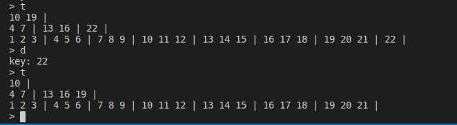
   
> Leaf페이지와 Internal 페이지 모두 타겟이 되는 페이지와 이웃페이지를 구별하는 부모페이지의 k_prime을 부모페이지에서 지워주는 것은 동일하지만 Leaf페이지는 k_prime이 이웃 페이지로 내려오지 않는 반면 Internal 페이지는 k_prime이 이웃 페이지로 내려온다는 차이점이 있습니다.  
    
또한 Leaf페이지의 경우 만약 해당 페이지가 부모페이지의 제일 왼쪽 페이지였다면 sibling 관계 유지를 위하여 왼쪽 Leaf 페이지를 루트로부터 탐색하는 과정이 추가되었습니다. 
     
예를 들어
<pre>
                              10 |
             4 7 |                         13 16 19| 
      1 2 3 | 4 5 6 | 7 8 9 |   10 11 12 | 13 14 15 | 16 17 18 | 19 20 21 |
</pre>
이러한 형태로 트리가 구성되어 있고   
10, 11, 12를 제거하게 된다면 루트에서부터 해당 페이지의 왼쪽페이지인 7, 8, 9가 들어있는 페이지를 탐색하고   
7, 8, 9 페이지의 sibling을 13, 14, 15 페이지로 재설정합니다.   
   
아래는 10, 11, 12를 제거한 뒤 Leaf 페이지의 제일 왼쪽 key부터 제일 오른쪽 key까지 나열한 이미지입니다.   
   
* 10, 11, 12 제거 이전   
   
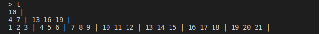
   
* 10, 11, 12 제거 이후
   
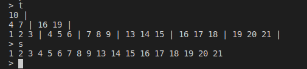   

* #### redistribute
Internal 페이지에서 delete가 발생했는데 이웃 페이지에 key를 삽입할 수 없을 경우 발생합니다.   
예를 들어 최대 key의 개수가 5라는 가정하에
<pre>
                           10 |
             4 |                                   16 19 22 25 28| 
      1 2 3 | 4 |          13 14 15 | 16 17 18 | 19 20 21 | 22 23 24 | 25 26 27 | 28 29 30 |
</pre>
이와 같은 트리에서 4를 제거할 경우
<pre>
                           10 |
              |                                   16 19 22 25 28| 
      1 2 3 |  |          13 14 15 | 16 17 18 | 19 20 21 | 22 23 24 | 25 26 27 | 28 29 30 |
</pre>
key의 개수가 0이므로 delayed merge를 실행하려고 보니 Internal 페이지에서 key가 최대로 차버린 것을 알 수 있습니다. 이러한 경우에   
<pre>
                                16 |
             10 |                                  19 22 25 28| 
      1 2 3 | 13 14 15 |             16 17 18 | 19 20 21 | 22 23 24 | 25 26 27 | 28 29 30 |
</pre>
이와 같이 merge 대신 redistribute을 실행하게 됩니다.   
   
아래는 실제 실행 결과입니다.   
   
* redistribute 이전   
   
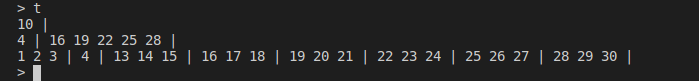   
   
* redistribute 이후   
   
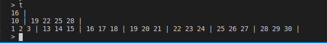   
   

* #### 이외에 bpt.cpp에 구현된 함수들
main에서 트리의 출력을 확인하는데 쓰인 함수들이기 때문에 설명을 생략했습니다.   
