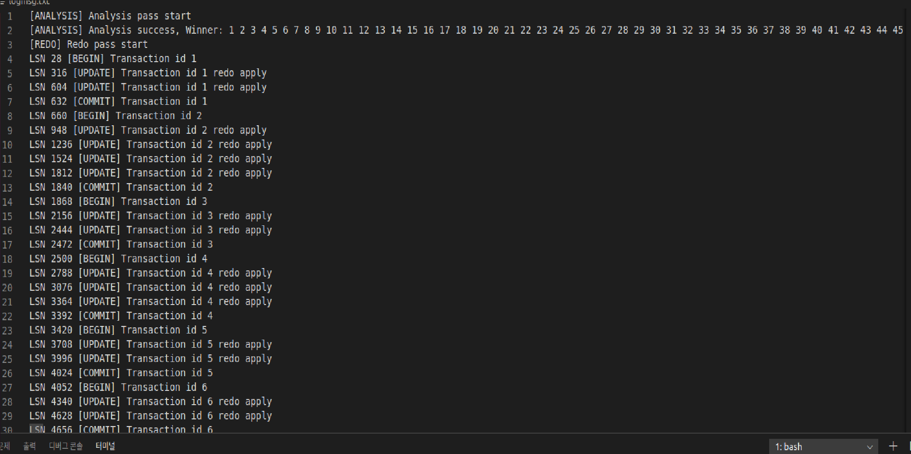
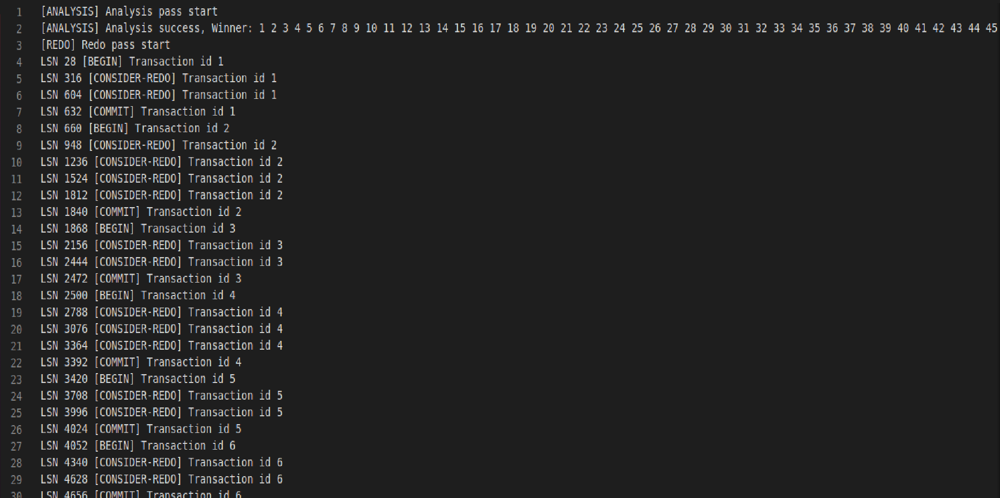
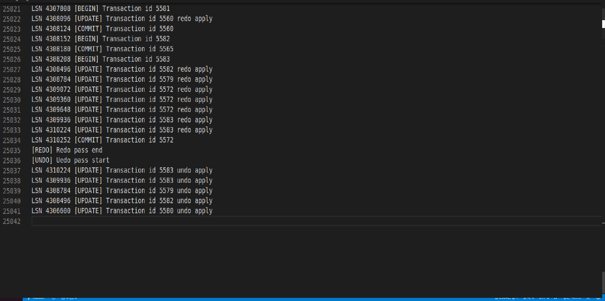
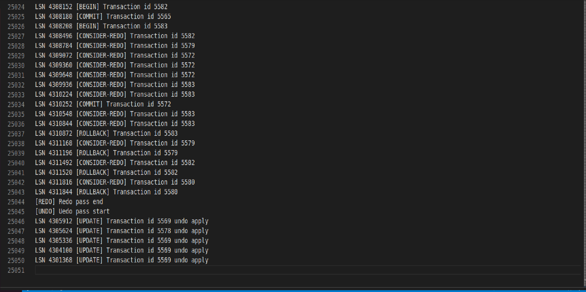

Introduce
=========
Recovery의 구현에 대한 프로젝트입니다. 로그의 시퀀스 번호는 로그의 마지막 오프셋을 기준으로 생성하였고 ARIES 방식으로 구현되었습니다.   
      
Commit된 트랜잭션의 결과는 DB에 저장되어야하고, Commit되지 못한 트랜잭션의 결과는 DB에 반영되어있지 않도록 해야합니다.   
그러나 DBMS가 작동하는 과정에서는 예상치 못한 Crash가 발생할 수 있고 이로 인해 DB가 위의 성질을 만족시킬 수 없을 가능성이 존재합니다.   
   
이러한 Crash가 난 이후에도 DB가 그 직전의 상태로 돌아갈 수 있도록 하기위해 Recovery가 필요합니다.   
Recovery는 두 가지 매니저의 작동을 기반으로 구현되었습니다.
   
1. Log Manager   
2. Recovery Manager   
   
DB의 상태를 이전으로 되돌리기 위해서는 DBMS가 이전에 어떠한 동작들을 수행했었는지에 대한 기록이 필요합니다. 이 기록을 로그라는 명칭의 데이터로 저장을 하고 로그 매니저는 로그를 디스크에 저장하는 역할을 수행합니다.   
   
리커버리 매니저는 디스크에 저장되어있는 로그를 기반으로 DBMS를 크래쉬 이전으로 되돌리는 역할을 수행합니다.   
   
또한 Recoevry와는 별개로 project5에서 구현한 Concurrency Control을 좀 더 일반적인 디자인으로 구현하였습니다.     
   
Feature
=======
* Log Manager
* Recovery Manager
* General Locking
   
Log Manager
============
로그의 발행 및 로그파일과의 동기화를 담당하는 Log Manager 입니다.    
log.cpp 소스코드 및 logManager.h 헤더파일에 구현되었습니다.   

* Introduce
* Log Publishing
* Flush

> #### Introduce   
로그 구조체는 역할에 따라서 다양한 종류로 구성되어있습니다.   
   
* ### basic log
<pre>
<code>
struct basicLog{
    uint64_t seqNo;
    uint64_t prevSeqNo;
    int trx_id;
    int type;
    int size;
};
</code>
</pre>
begin, commit, rollback 시에 발행되는 로그입니다.    
각각 begin은 트랜잭션이 생성되었을 때 발행되고, commit은 트랜잭션이 커밋되었을 때 발행되고,    
rollback은 트랜잭션이 되돌림이 마무리되었을 떄 발행됩니다.   
   
해당 로그가 가지고 있는 정보는 로그의 시퀀스 넘버, 동일 트랜잭션 내에서 발행된 이전 로그의 번호, 트랜잭션 번호, 로그의 타입, 로그의 크기로
구성되어있습니다.     
   
> 만약 해당 로그가 트랜잭션의 첫 번째 로그라면 prevSeqNo는 0의 값을 가집니다.    
   
* ### update log
<pre>
<code>
struct updateLog{
    uint64_t seqNo;
    uint64_t prevSeqNo;
    int trx_id;
    int type;
    
    int table_id;
    uint64_t pagenum;
    int offset;
    int dataLength;
    char undo[120];
    char redo[120];

    int size;
};
</code>
</pre>
update 시에 발행되는 로그입니다. redo를 위해 basic 로그로부터 추가된 정보들이 존재합니다.   
해당 update의 대상이 되는 테이블 id, 오프셋, 데이터의 길이, undo(update 이전 레코드), redo(update 이후 레코드), 로그의 크기입니다.   
   
* ### compensate log
<pre>
<code>
struct compensateLog{
    uint64_t seqNo;
    uint64_t prevSeqNo;
    int trx_id;
    int type;

    int table_id;
    uint64_t pagenum;
    int offset;
    int dataLength;
    char undo[120];
    char redo[120];

    uint64_t nextUndoSeqNo;

    int size;
};
</code>
</pre>
update 동작을 되돌려줄 때 발행되는 로그입니다. 트랜잭션이 abort되거나 리커버리의 undo 단계에서 발행될 수 있습니다.    
   
update로그의 구성요소에 추가하여 nexUndoSeqNo라는 멤버가 추가되었습니다.      
해당 변수는 ARIES 방식에서 사용하는 next undo sequence number를 의미합니다.      
    
* ### Transaction Table
로그 매니저는 로그의 발행을 트랜잭션별로 관리하기 위해 트랜잭션 테이블이라는 구성요소를 가지고 있습니다.    
트랜잭션 테이블은 로그를 발행을 위한 정보를 관리합니다.      
<pre>
<code>
struct trxTable{
    trxTable* next = NULL;
    int trx_id;

    uint64_t lastSeqNo = 0;

    stack<uint64_t> updateSeqNoStack;
    uint64_t nextUndoSeqNo = 0;
};
</code>
</pre>
트랜잭션 테이블은 해쉬테이블의 형태로 구성되어있고 이를 위한 next 포인터를 가지고 해당 트랜잭션의 id 또한 저장되어있습니다.   
   
lastSeqNo은 해당 트랜잭션이 발행한 마지막 로그의 시퀀스 넘버를 의미합니다. 이후 새로 발행된 로그의 prevSeqNo에 사용됩니다.   
    
updateSeqNoStack은 해당 트랜잭션이 발행한 update로그들의 시퀀스 넘버를 스택으로 저장하는 데 사용됩니다. 가장 최근에 발행된 update로그가 스택의 top에 위치합니다. 이 스택은 이후에 compensate로그를 발행할 때 사용됩니다.   
   
nextUndoSeqNo 또한 이후 발생할 compensate로그의 발행에 사용되는 변수입니다.    
새로 발행되는 compensate의 nextUndoSeqNo를 위해 사용됩니다.    
   
* ### Meta Log
리커버리 이후에 발행되는 로그의 시퀀스 번호와 트랜잭션 id를 durable하게 관리하기 위해 사용되는 로그입니다.   
로그파일의 맨 앞에 위치하고 새로운 로그의 발행과 새로운 트랜잭션의 생성은 이러한 메타 로그를 기준으로 발생합니다.   
<pre>
<code>
struct MetaLog{
    uint64_t metaLSN;
    int metaTrxId;
};
</code>
</pre>
metaLSN은 새로운 로그 시퀀스 넘버의 기준이 되는 값입니다.   
예를 들어 어떠한 DBMS가 크래쉬가 나기 이전에 로그파일에 저장되었던 로그의 시퀀스 넘버가 100이라면 이를 리커버리하는 과정의 시작부터 새롭게 발행되는 로그의 시퀀스 번호 또한 100보다 큰 값부터 시작해야합니다. metaLSN은 이와같이 새로운 로그 시퀀스 넘버의 기준이 되는 값입니다.   
   
metaTrxId 또한 마찬가지로 크래쉬 당시 트랜잭션이 100까지 생성되었다면 리커버리 이후 새롭게 시작되는 트랜잭션의 id를 101부터 durable하게 맞춰주기 위해 사용되는 값입니다.   
   
* ### Log Manager
<pre>
<code>
class LogManager{
private:
    /* Managing trxTable with hash */
    trxTable* trxTableHash = NULL;

    /* Log Buffer */
    char buf[SIZE_LOG_BUF];

    /* Maintain offset about buffer and file */
    uint64_t tailBuf = 0;
    uint64_t tailFile = 0;

    /* For manage log file */
    int logFileFd = -1;

    /* For durable LSN, trx id */
    MetaLog* metaLog;
public:
    /* Initialize - destroy */
    LogManager(char* logfile_path);
    ~LogManager();

    /* Get log file's fd */
    int get_logFileFd();

    /* Publish log */
    uint64_t publish_beginLog(int trx_id);
    uint64_t publish_commitLog(int trx_id);
    uint64_t publish_rollbackLog(int trx_id);
    uint64_t publish_updateLog(int trx_id, int table_id, uint64_t pagenum, int offset, char* undo, char* redo);
    uint64_t publish_compensateLog(int trx_id, int table_id, uint64_t pagenum, int offset, char* undo, char* redo);

    /* Manager offset */
    void move_tailBuf(int size);
    void sync_tails();
    uint64_t get_tailBuf();

    /* Get trx table */
    trxTable* get_trxTable(int trx_id);
    /* Set trx table */
    void set_trxTable(int trx_id);
    /* Delete trx table */
    void delete_trxTable(int trx_id);
    /* Update trx table */
    void update_trxTable(int trx_id, uint64_t newSeqNo, int type);

    /* Flush */
    bool is_stuck(int size);
    void bufFlush();

    /* Get meta log */
    MetaLog* get_metaLog();
};
</code>
</pre>
로그 매니저의 선언부분입니다.   
   
로그 매니저는 트랜잭션 테이블을 해쉬테이블로 관리합니다. 또한 내부적으로 로그 버퍼를 가지고 있습니다.   
로그 버퍼를 관리하기 위해 tailBuf, tailFile이라는 변수를 사용합니다.   
   
tailBuf는 버퍼상에 존재하는 마지막 로그의 끝을 가리키는 변수입니다. tailFile은 로그 파일에 존재하는 마지막 로그의 끝을 가리키는 변수입니다.   
   
로그를 파일에 저장하려면 파일의 fd를 알아야합니다. 로그 매니저는 처음 할당될 때 인자로 로그 파일의 경로를 받고, 해당 파일을 open한 후 fd를 인자로 보유합니다.   
   
로그파일을 처음 open하면서 파일의 맨 앞에 있는 meta log의 정보를 읽어서 멤버 변수에 저장합니다.   
이를 기반으로 새로운 로그의 발행과 트랜잭션을 생성됩니다.      
   
> #### Log Publishing
로그의 발행은 로그 매니저의 멤버 함수를 이용합니다.   
   
* ### publish_beginLog
begin 로그를 발행할 때 사용하는 함수입니다.   
   
* ### publish_commitLog
commit 로그를 발행할 때 사용하는 함수입니다.   
내부적으로 로그 버퍼 플러쉬를 진행합니다.   
   
* ### publish_rollbackLog
rollback 로그를 발행할 때 사용하는 함수입니다.   
   
* ### publish_updateLog
update 로그를 발행할 때 사용하는 함수입니다.   
   
* ### publish_compensateLog
compensate 로그를 발행할 때 사용하는 함수입니다.   
   
> 위의 함수들은 내부적으로 tailBuf를 조절하며 발행됩니다.   
> 새로운 로그 객체가 생성된 이후에는 로그 매니저가 관리하는 로그 버퍼로 바이트단위 복사됩니다.   
> 또한 로그를 발행하면서 트랜잭션 테이블의 구성요소들도 최신화됩니다.   
   
> #### Flush
로그 매니저의 로그 버퍼가 디스크로 내려가는 경우는 3가지 경우가 존재합니다.   
   
1. commit
2. page write
3. Full buffer
   
1번의 경우는 commit 로그를 발행하면서 내부적으로 로그 버퍼의 flush가 일어납니다.   
2번의 경우는 page eviction을 해야할 때, 해당 페이지가 dirty여서 디스크와 동기화를 시켜줘야한다면 로그 버퍼 또한 flush합니다.   
3번의 경우는 로그 버퍼가 꽉차서 더이상 로그를 버퍼에 담을 수 없을 때 flush합니다.   
     
Recovery
========
크래쉬가 난 이후에는 로그 파일을 바탕으로 리커버리를 진행하게 됩니다.   
recovery.cpp 소스 파일과 recoveryManager.h 헤더파일에 구현되어있습니다.   
   
* Introduce
* Analysis
* Redo
* Undo
* Simple test result
* Last of Recovery
   
> #### Introduce
리커버리 매니저의 구조입니다.   
<pre>
<code>
class RecoveryManager{
private:
    /* Used for recovery, contain log */
    char buf[SIZE_LOG_BUF];
    int bufOffset = 0;

    /* Log file fd */
    int logFileFd = -1;

    /* Log message file's file pointer */
    FILE* fp_log_message_file;
    
    /* bufPin is the offset of the file corresponding to start of the log buffer */
    /* startLSN is the LSN corresponding to start log's LSN in the log buffer  */
    int bufPin = 0;
    int startLSN = 0;

    /* For artificial crash */
    int checkedLogNum = 0;

    /* For choosing next undo trx */
    priority_queue<MaxQNode> maxPq;

    /* Winner, Loser */
    set<int> winnerSet;
    set<int> loserSet;

    /* Largest trx id */
    int maxTrxId = 0;

    /* Table id of target file */
    stack<int> idStack;
    bool idList[MAX_TABLE_NUM];

    /* Meta log */
    MetaLog* metaLog;
public:
    /* Initialize */
    /* Assume that log file is already open */
    /* So log manager must be initailized before recovery manager created */
    RecoveryManager(int logFileFd, char* log_message_fileName, MetaLog* metaLog);

    /* Raise new logs */
    void rasiseNewLog();

    /* Decode log */
    uint64_t get_seqNo();

    /* Analysis */
    void analysis();

    /* Redo */
    void redo(int log_num);
    void redoUpdateLog(updateLog* update_log);
    void redoCompensateLog(compensateLog* compensate_Log);

    /* Undo */
    void undo(int log_num);
    void make_priority_queue_about_loser();

    /* Increase trx id when meet the begin log */
    int get_maxTrxId();

    /* Get target file's id */
    stack<int> get_table_id_stack();
};
</code>
</pre>
리커버리 매니저는 로그 매니저와 별개의 로그 버퍼를 가지고 있습니다. 리커버리 매니저는 이 로그 버퍼를 활용하여 리커버리를 진행하고, 리커버리 과정에서 새롭게 생겨나는 로그들은 리커버리 매니저와 별개로 로그 매니저의 버퍼에 의해 발생합니다.   
   
리커버리 매니저는 우선순위 큐를 가지고 있습니다. 이것은 후에 undo과정에서 사용됩니다.   
   
리커버리의 대상이 되는 테이블들의 id를 스택에 담아서 보관합니다. 후에 리커버리가 끝나면 해당 스택에서 하나씩 꺼내면서 page flush 및 close를 합니다.   
   
Analysis 과정에서 위너와 루저를 구별하여 set 자료구조 형태로 보관합니다.   
   
로그 매니저로부터 메타 로그를 받아서 멤버 변수로 저장합니다. 이는 이후 리커버리 과정에서 발행하는 로그의 시퀀스 넘버에 활용됩니다.   
   
리커버리 매니저의 로그 버퍼를 관리하기 위한 멤버 변수들을 보다 자세히 설명하겠습니다.   
* ###  bufOffset
리커버리 매니저의 로그 버퍼의 오프셋을 나타냅니다. 즉, 현재 리커버리를 진행중인 로그가 로그 버퍼상에서 어느 위치에 있는 지를 표현합니다.   
   
* ### bufPin 
현재 리커버리 매니저의 로그 버퍼에 올라온 데이터가 로그 파일의 어느 위치부터 시작하는 지를 나타내는 변수입니다.   
   
* ### startLSN 
리커버리 매니저의 로그 버퍼에 올라와있는 로그들 중 가장 앞에 있는 로그 이전 로그의 lsn입니다.   
예를 들어
현재 로그 버퍼에 올라와있는 로그들 중 첫 번째 로그의 lsn이 x라면, startLSN은 x - sizeof(1st log) 입니다.   
   
   
* ### MaxQ
추가로 우선순위 큐의 노드에 대한 설명입니다.   
<pre>
<code>
struct MaxQNode{
    trxTable* trxTablePtr;
    uint64_t nextUndoSeqNo;
};
</code>
</pre>
리커버리 매니저는 우선순위 큐를 가지고 있습니다. 이는 undo 과정에서 활용됩니다.   
우선순위 큐의 구성요소인 노드는 다음과 같이 구성되어있습니다.   
1. 트랜잭션 테이블의 포인터
2. next undo sequence number
이것의 의미는 어떠한 트랜잭션이 어떠한 next undo lsn값을 가졌는 지를 나타냅니다.   
   
> #### Analysis
로그 파일을 처음부터 끝까지 읽으면서 위너와 루저를 구별합니다.   
<pre>
<code>
void RecoveryManager::analysis(){
    fprintf(fp_log_message_file, "[ANALYSIS] Analysis pass start\n");

    rasiseNewLog();

    bufOffset = 0;
    int seqNo = get_seqNo();
    int startOffset = log_manager->get_tailBuf();

    while (seqNo != 0){
        /* Parsing begin, commit, rollback logs */
        basicLog* basic_log = new basicLog;

        switch (seqNo - startOffset)
        {
        case SIZE_BASIC_LOG:
            memcpy(basic_log, buf + bufOffset, SIZE_BASIC_LOG);
            if (basic_log->type == BEGIN_T){
                /* If log type is begin, set new trx table. It will be used publishing new log */
                log_manager->set_trxTable(basic_log->trx_id);

                /* Put trx id into loser Set */
                loserSet.insert(basic_log->trx_id);
            }   
            else{
                /* If log tpye is commit or rollback, this trx will not publish new log. So delete trx table */
                log_manager->delete_trxTable(basic_log->trx_id);

                /* Move trx id from loser Set to winner Set */
                loserSet.erase(basic_log->trx_id);

                winnerSet.insert(basic_log->trx_id);
            }
            break;
        default:
            break;
        }

        /* Delete log instance. */ 
        delete basic_log;

        /* Set other information */
        bufOffset += (seqNo - startOffset);
        startOffset = seqNo;
        seqNo = get_seqNo();
        if (seqNo - startLSN >= SIZE_LOG_BUF){
            bufPin += startOffset - startLSN;
            startLSN = startOffset;
            rasiseNewLog();
            bufOffset = 0;
        }
    }

    /* Max trx id */
    int maxWinner = 0;
    int maxLoser = 0;

    set<int>::iterator iter;
    
    fprintf(fp_log_message_file, "[ANALYSIS] Analysis success, Winner:");

    for (iter = winnerSet.begin(); iter != winnerSet.end(); iter++){
        maxWinner = *iter;
        fprintf(fp_log_message_file, " %d", *iter);
    }

    fprintf(fp_log_message_file, ", Loser:");
    for (iter = loserSet.begin(); iter != loserSet.end(); iter++){
        maxLoser = *iter;
        fprintf(fp_log_message_file, " %d", *iter);
    }
    fprintf(fp_log_message_file, "\n");

    maxTrxId = maxWinner > maxLoser ? maxWinner : maxLoser;
}
</code>
</pre>
위너는 winner set에, 루저는 loser set에 저장합니다.   
   
또한 begin로그를 만나면 로그 발행을 위해 필요한 트랜잭션 테이블을 생성하고,   
commit 로그 혹은 rollback 로그를 만나면 해당 트랜잭션들은 더이상 로그를 발행하지 않기 때문에 트랜잭션 테이블을 제거합니다.   
   
> #### Redo
<pre>
<code>
void RecoveryManager::redo(int log_num){
    fprintf(fp_log_message_file, "[REDO] Redo pass start\n");

    /* If first phase does not in buffer, raise it */ 
    if (bufPin != sizeof(MetaLog)){
        bufPin = sizeof(MetaLog);
        rasiseNewLog();

        startLSN = metaLog->metaLSN;
    }

    bufOffset = 0;
    int seqNo = get_seqNo();
    int startOffset = log_manager->get_tailBuf();

    while (seqNo != 0){
        basicLog* basic_log = new basicLog;
        updateLog* update_log = new updateLog;
        compensateLog* compensate_log = new compensateLog;

        /* Distinguish log type */
        int type;

        switch (seqNo - startOffset)
        {
        case SIZE_UPDATE_LOG:
            /* Copy data in log buffer to the log instance and distinguish log type*/
            memcpy(update_log, buf + bufOffset, SIZE_UPDATE_LOG);
            type = UPDATE_T;
            /* Move log manager's buffer tail for publishing new log at undo pass */
            log_manager->move_tailBuf(SIZE_UPDATE_LOG);
            /* Synchronize tail of log buffer and tail of log file */
            /* After crash, log manager's log buffer is empty(not recovery manager's buffer). This case is tailBuf = tailFIle */
            log_manager->sync_tails();
            /* If target file is not open */
            if (!idList[update_log->table_id - 1]){
                /* Open for recovery */
                char path[20];
                sprintf(path, "DATA%d", update_log->table_id);
                open_table(path);
                idList[update_log->table_id - 1] = true;
                idStack.push(update_log->table_id);
            }
            break;
        case SIZE_COMPENSATE_LOG:
            /* Copy data in log buffer to the log instance and distinguish log type*/
            memcpy(compensate_log, buf + bufOffset, SIZE_COMPENSATE_LOG);
            type = COMPENSATE_T;
            /* Move log manager's buffer tail for publishing new log at undo pass */
            log_manager->move_tailBuf(SIZE_COMPENSATE_LOG);
            /* Synchronize tail of log buffer and tail of log file */
            /* After crash, log manager's log buffer is empty(not recovery manager's buffer). This case is tailBuf = tailFIle */
            log_manager->sync_tails();
            break;
        default:
            /* Copy data in log buffer to the log instance and distinguish log type*/
            memcpy(basic_log, buf + bufOffset, SIZE_BASIC_LOG);
            /* Move log manager's buffer tail for publishing new log at undo pass */
            log_manager->move_tailBuf(SIZE_BASIC_LOG);
            /* Synchronize tail of log buffer and tail of log file */
            /* After crash, log manager's log buffer is empty(not recovery manager's buffer). This case is tailBuf = tailFIle */
            log_manager->sync_tails();
            if (basic_log->type == BEGIN_T){
                type = BEGIN_T;
            }
            else if (basic_log->type == COMMIT_T){
                type = COMMIT_T;
            }
            else{
                type = ROLLBACK_T;
            }
            break;
        }

        /* Redo about target log */
        switch (type)
        {
        case UPDATE_T:
            redoUpdateLog(update_log);
            break;
        case COMPENSATE_T:
            redoCompensateLog(compensate_log);
            break;
        case BEGIN_T:
            fprintf(fp_log_message_file, "LSN %lu [BEGIN] Transaction id %d\n", basic_log->seqNo, basic_log->trx_id);
            break;
        case COMMIT_T:
            fprintf(fp_log_message_file, "LSN %lu [COMMIT] Transaction id %d\n", basic_log->seqNo, basic_log->trx_id);
            break;
        case ROLLBACK_T:
            fprintf(fp_log_message_file, "LSN %lu [ROLLBACK] Transaction id %d\n", basic_log->seqNo, basic_log->trx_id);
            break;
        }

        /* Delete log instance */
        delete basic_log;
        delete update_log;
        delete compensate_log;

        /* Set next log */
        /* If buffer is full, raise new logs */
        /* Set other information */
        bufOffset += (seqNo - startOffset);
        startOffset = seqNo;
        seqNo = get_seqNo();
        if (seqNo - startLSN >= SIZE_LOG_BUF){
            bufPin += startOffset - startLSN;
            startLSN = startOffset;
            rasiseNewLog();
            bufOffset = 0;
        }

        checkedLogNum++;
        if (log_num != 0 && log_num == checkedLogNum){
            fclose(fp_log_message_file);
            return;
        }
    }

    fprintf(fp_log_message_file, "[REDO] Redo pass end\n");
}
</code>
</pre>
다시 로그 파일의 처음부터 끝까지 읽습니다.   
   
이제부터는 로그 매니저의 상태도 크래쉬 이전과 동일하게 맞춰주기 위해서 로그들을 만날 때마다 해당 트랜잭션 테이블 또한 업데이트 시켜줍니다.   
단, 이미 제거된 트랜잭션 테이블은 업데이트 시키지 않습니다.   
   
또한 update로그를 만나면 해당 로그의 대상이 되는 테이블을 open합니다. 이미 open되었는지의 여부를 idList라는 bool list를 활용하여 확인합니다.   
   
로그 매니저의 tail관련 정보들도 지속적으로 업데이트 시킵니다. Redo 과정에서 로그 매니저의 tail 정보들을 크래쉬 이전과 동일하게 맞춰줘야 Undo 과정에서 새로운 로그들을 durable하게 발행할 수 있습니다.    
   
update로그와 compensate로그를 redo할 때 먼저 타겟이 되는 페이지의 lsn번호를 확인합니다.   
페이지에 적힌 lsn값이 해당 로그의 lsn보다 크거나 같다면 redo를 건너뛰는 consider-redo방식을 택하였습니다.   
   
> #### Undo
Undo를 직접적으로 실행하기에 앞서, 어떠한 트랜잭션을 먼저 undo해야할지 정해야합니다.   
각 루저 트랜잭션들은 undo해야하는 LSN이 있습니다. 루저 트랜잭션 중 이 undo의 대상이 되는 LSN이 가장 큰 것을 선별하는 작업이 필요합니다.   

* ### make_priority_queue_about_loser()   
이러한 작업을 우선순위 큐를 활용하여 진행합니다.   
우선순위 큐(max)에 트랜잭션의 next undo sequence number에 대한 정보를 넣고 pop을 하여 해당 트랜잭션의 update 로그를 undo하고   
다시 next undo sequence number를 변경한 후 큐에 다시 넣는 방식으로 작동합니다.   
   
* ### Undo
<pre>
<code>
void RecoveryManager::undo(int log_num){
    fprintf(fp_log_message_file, "[UNDO] Uedo pass start\n");

    checkedLogNum = 0;
    
    /* make priority queue */
    make_priority_queue_about_loser();

    /* Undo */
    while (!(maxPq.empty())){
        /* Get trx info that has highest next undo number */
        MaxQNode qNode = maxPq.top();
        maxPq.pop();

        int size;

        /* Set buffer for next undo number */
        /* LSN is end offset of log and LSN is located in start of log. */
        /* It makes analysis and redo to know the size of log immediately. */
        /* But undo read from end of log. So it must read first about size of log */
        if (qNode.nextUndoSeqNo - sizeof(int) < startLSN){
            /* If can't read size of log(Out of buffer) */
            /* Raise new buffer */
            /* New buffer's end is qNode.nextUndoSeqNo */
            if (qNode.nextUndoSeqNo - SIZE_LOG_BUF < metaLog->metaLSN){
                /* If new buffer's start is less than metaLSN, restrict start point to metaLSN */
                startLSN = metaLog->metaLSN;
            }
            else{
                startLSN = qNode.nextUndoSeqNo - SIZE_LOG_BUF;
            }
            bufPin = startLSN - metaLog->metaLSN + sizeof(MetaLog);
            rasiseNewLog();

            /* Read size of next undo log */
            memcpy(&size, buf + (qNode.nextUndoSeqNo - startLSN - sizeof(int)), sizeof(int));
        }
        else{
            /* If can read size of log */
            /* Read size of next undo log */
            memcpy(&size, buf + (qNode.nextUndoSeqNo - startLSN - sizeof(int)), sizeof(int));

            /* If log is truncated by start of buffer, rasie new buffer */
            /* New buffer's end is qNode.nextUndoSeqNo */
            if (qNode.nextUndoSeqNo - size < startLSN){
                if (qNode.nextUndoSeqNo - SIZE_LOG_BUF < metaLog->metaLSN){
                    /* If new buffer's start is less than metaLSN, restrict start point to metaLSN */
                    startLSN = metaLog->metaLSN;
                }
                else{
                    startLSN = qNode.nextUndoSeqNo - SIZE_LOG_BUF;
                }
                bufPin = startLSN - metaLog->metaLSN + sizeof(MetaLog);
                rasiseNewLog();
            }
        }

        /* Set start offset of undoing update log */
        /* Undoing log is update log */
        int startOffset = (qNode.nextUndoSeqNo - startLSN - size);

        trxTable* targetTable = qNode.trxTablePtr;
        updateLog* update_log = new updateLog;

        /* Copy to update_log */
        memcpy(update_log, buf + startOffset, size);

        /* Publish compensate log about undo */
        uint64_t publishedSeqNo = log_manager->publish_compensateLog(update_log->trx_id, update_log->table_id, update_log->pagenum, update_log->offset, update_log->redo, update_log->undo);
        // update_log->redo will be compensate_log's undo. update_log->undo will be compensate_log's redo.
        // trx table will be updated in publish_compensateLog()
        // Recovery is working in single thread, mutex does not required

        LeafPage leafPage;
        buffer_read_page(update_log->table_id, update_log->pagenum, &leafPage);

        /* Consider undo */
        if (leafPage.pageLSN >= update_log->seqNo){
            /* Undo record of target page */
            int i = (update_log->offset - PAGE_HEADER_SIZE - sizeof(int64_t))/sizeof(Record);
            memcpy(leafPage.record[i].value, update_log->undo, update_log->dataLength);
            
            /* Update last update log sequence number */
            /* targetTable's last sequence number is compensate log */ 
            leafPage.pageLSN = publishedSeqNo;

            buffer_write_page(update_log->table_id, update_log->pagenum, &leafPage);

            fprintf(fp_log_message_file, "LSN %lu [UPDATE] Transaction id %d undo apply\n", update_log->seqNo, update_log->trx_id);
        }
        else{
            /* Consider undo */
            buffer_complete_read_without_write(update_log->table_id, update_log->pagenum);

            fprintf(fp_log_message_file, "LSN %lu [CONSIDER-UNDO] Transaction id %d\n", update_log->seqNo, update_log->trx_id);
        }

        /* If trx does not have update log, publish rollback log */
        /* Else update qNode with new next undo number, push into priority queue again */
        if (targetTable->nextUndoSeqNo == 0){
            log_manager->publish_rollbackLog(update_log->trx_id);
        }
        else{
            qNode.nextUndoSeqNo = targetTable->nextUndoSeqNo;
            maxPq.push(qNode);  
        }

        /* Delete log instance */
        delete update_log;

        checkedLogNum++;
        if (log_num != 0 && checkedLogNum == log_num){
            fclose(fp_log_message_file);
            return;
        }
    }

    fprintf(fp_log_message_file, "[UNDO] Undo pass end\n");

    fclose(fp_log_message_file);

    /* Flush will occured in last of init_db() */
}
</code>
</pre>
맥스큐에서 pop합니다. 해당 노드가 가리키는 시퀀스 번호가 리커버리 매니저의 버퍼에 없다면, 로그 버퍼의 끝지점이 undo하고자 하는 로그의   
LSN이 되도록 디스크로부터 데이터를 읽어옵니다.   
   
먼저 타겟이 되는 LSN으로부터 버퍼의 시작방향으로 4바이트를 읽어서 로그의 크기를 확인한 후 해당 부분을 인스턴스로 파싱합니다.   
   
본격적으로 undo를 진행하기 전에, 해당 로그에 대한 compensate 로그를 발행합니다.    
앞서 언급된 대로 로그를 발행하는 과정에서 트랜잭션 테이블의 정보도 업데이트 됩니다. 새롭게 바뀐 트랜잭션 테이블의 정보를 바탕으로 큐노드의 next undo lsn 값 또한 변경해줍니다.   
   
만약 이 값이 0이라면 해당 트랜잭션에 대해서 더이상 undo할 update가 남지 않았다는 의미이기 때문에 rollback로그를 발행하고 큐노드를 다시 넣지 않습니다.   
   
그러나 0이 아니라면 undo할 update가 남아있다는 의미이기 때문에 큐노드의 정보를 업데이트하고 다시 우선순위 큐에 push합니다.   
   
> #### Simple result 
리커버리의 결과에 대한 간단한 캡쳐입니다.
   
1. 100번째 로그까지 redo

2. 100번째 로그까지 다시 redo(consider-redo)

3. 5개 로그 undo

4. 5개 로그 undo 반복

   
> #### Last of Recovery
리커버리를 성공적으로 undo까지 마쳤다면 마지막에 발행된 로그의 LSN과 현재까지 시작된 트랜잭션 중 가장 큰 id를 파악하여   
로그 파일의 meta 로그 부분에 저장합니다.   
   
General Locking
===============
이전까지는 key가 페이지에 고정되어있는 상황을 기준으로 구현했다면 이제는 좀 더 일반적으로 key가 다른 페이지로 이동하거나 사라질 가능성을 염두해두고 구현하였습니다.   
   
이를 위해 변경된 것들에 대한 설명입니다.   
   
* Lock Managing
* Crab
   
> #### Lock Managing
project5에서 api가 작동하는 방식을 살펴보면 다음과 같습니다.   
   
1. 페이지 래치를 얻는다.
2. key의 존재여부를 판단한다.
3. 페이지 래치를 푼다.
4. lock의 획득을 시도한다.
5. lock을 획득 시에 다시 페이지 래치를 얻는다.
6. operation 진행
   
그러나 3번에서 페이지 래치를 풀고, 5번에서 다시 페이지 래치를 얻는 과정에서 타겟이 되는 key가 다른 페이지로 이동하거나 사라졌을 가능성이 존재합니다.   
    
그렇기 때문에 이 과정을 다음과 같이 변경하였습니다.   
   
1. 페이지 래치를 얻는다.
2. key의 존재여부를 판단한다.
3. lock의 획득을 시도한다.   
3-1. lock을 획득 하였다면 operation을 진행하고 페이지 래치를 푼다.   
3-2. 기다려야한다면 페이지 래치를 풀고 lock을 획득한 후에 다시 페이지를 탐색한다. 이미 lock을 얻은 상태에서 페이지를 찾기 때문에 이후 바로 operation을 진행할 수 있다.   
3-3. 데드락이 발생하였다면 페이지 래치를 풀고 abort를 진행한다.   
   
> #### Crab
위의 과정을 통해 일단 leaf 페이지를 성공적으로 잡았다면 key가 페이지 밖으로 이동하지 않을 것이라는 것을 확신할 수 있습니다.   
그러나 루트 페이지에서부터 leaf페이지를 찾는 과정을 만약 다음과 같이 한다면 문제가 발생합니다.   
   
1. 루트 페이지를 잡는다.
2. 내려갈 페이지 번호를 파악하고 루트 페이지를 푼다.
3. 다음 페이지를 잡는다.
4. 또 다음 내려갈 페이지 번호를 파악하고 페이지를 푼다.
   
페이지A를 잡고 풀고, 그 다음에 페이지B를 잡고 푸는 방식으로 한다면 맨 처음 A를 봤을 때는 key가 B페이지에 있어야하지만 A를 푼 시점에 key가 이동할 수 있습니다. 이 상황에서 B를 잡는 것은 잘못된 탐색이 될 수 있습니다.   
   
이를 해결하기 위해 Crab방식을 활용합니다.   
   
1. 페이지A를 잡는다.
2. 페이지B를 잡는다.
3. 페이지A를 푼다.   
   
이러한 방식을 사용한다면 A를 잡고 key가 있어야하는 B또한 잡아서 key가 이동하지 못하게 한 후 A를 풀어주게 됩니다.   
그러나 위의 절차를 그대로 진행하면 데드락이 발생합니다.   
   
그 이유는 다음과 같습니다.   
A를 잡은 트랜잭션이 B 또한 잡으려고 합니다. 이 때 버퍼 래치를 잡고 B페이지 래치를 기다리고 있습니다.   
B를 잡고 있던 트랜잭션 또한 B를 풀어야하고 이를 위해서 C라는 페이지를 먼저 잡고자 합니다.   
이 때, B를 잡고 있는 트랜잭션 또한 버퍼 래치를 잡아야하고 여기서 데드락이 발생합니다.   
즉, 한쪽은 버퍼 래치를 잡은 상태에서 B페이지를 원하고 다른 쪽은 B페이지를 잡은 상태에서 버퍼 래치를 원하는 상황이 발생합니다.   
   
이를 해결하기 위해 별도의 뮤텍스를 선언하여 루트페이지로부터 리프페이지를 탐색하는 동안 다른 트랜잭션끼리 서로 보유한 페이지가 곂치지 않도록 조절하였습니다.   
   